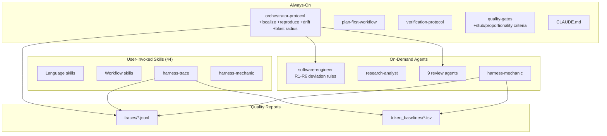

# ABOUTME: Project retrospective capturing architecture decisions, lessons, and gotchas
# ABOUTME: Living document updated after significant features, bugs, and integrations

# Claude Forge - Learning Documentation

## Project Overview

Claude Forge is a token-optimized three-tier harness for Claude Code: **rules** (always active), **agents** (on-demand reviewers), and **skills** (user-invoked domain knowledge). It started as a collection of markdown files and evolved into a structured system with quality gates, an orchestrator loop, vault integration, and a knowledge feedback cycle.

## Architecture

## Tech Stack & Decisions

| Technology | Why | Trade-offs |
|------------|-----|------------|
| Markdown-only harness | Zero dependencies, loads directly into context window | No programmatic validation; relies on LLM compliance |
| Pydantic for trace schema | Type-safe, auto-validation, great serialization | Adds Python dependency to what's otherwise pure markdown |
| tiktoken for token counting | Exact counts for Claude's tokenizer family | External dep, but already in Python stack |
| JSONL for traces | LLM-readable, appendable, one-line-per-step | No querying without parsing; fine for <100 sessions |
| Table-heavy markdown | Token-efficient, scannable | Less prose context; assumes reader knows the domain |

## Lessons Learned

### 2026-03-31: Meta-Harness - Automated Harness Optimization

**Context:** Read the Meta-Harness paper (arxiv 2603.28052, Stanford) which shows that automated optimization of LLM harnesses beats hand-engineering. Applied its concepts to claude-forge.

**Problem:** Our entire harness (rules, agents, skills) was hand-engineered with no measurement infrastructure. No way to know which rules actually help, which waste tokens, or where the orchestrator systematically fails.

**Solution:** Three-phase implementation inspired by Meta-Harness:

1. **Trace capture** (harness-trace skill): Python CLI that extracts structured JSONL traces from raw Claude Code session files. Heuristic parser identifies orchestrator steps (REFINE, IMPLEMENT, VERIFY, REVIEW, SCORE, etc.) from assistant message text.

2. **Token baselining** (same skill): tiktoken-based scanner that classifies every harness file by tier (always-on vs on-demand) and measures exact token consumption. First baseline revealed: 3,723 tokens always-on, 103,395 total.

3. **Harness mechanic** (new agent + skill): Reads traces and baselines, identifies systematic failure patterns (repeated step failures, score stuck below threshold, routing gaps), proposes evidence-based rewrites. Never auto-applies; always RED in decision framework.

**Takeaways:**

- **Gemini's reordering was right.** We initially planned eval loop first, but Gemini argued "you can't optimize what you can't measure." Reversing to traces -> measurement -> optimization was the correct call. The /second-opinion auto-trigger for complex decisions paid off here.

- **OTel is overkill for single-developer CLI tools.** Gemini caught this too: the trace consumer is an LLM agent reading a filesystem, not Grafana. Simple JSONL with flat structure is the right format.

- **Static compression > dynamic loading.** The paper's 4x token reduction came from the optimizer finding denser words, not from lazy-loading mechanisms. Claude Code manages its own context window; trying to inject dynamic loading would fight the tool.

- **Real sessions as benchmarks, not synthetic.** Gemini's key insight: if you optimize your Go skill using a benchmark of "build a ToDo app," the optimizer will ruthlessly delete advanced context. Use actual historical work for evaluation.

- **Gemini code review caught a real bug.** The multi-round step deduplication logic only allowed LOOP, FIX, and VERIFY to repeat across orchestrator rounds. But in a real multi-round loop, IMPLEMENT, REVIEW, and SCORE also repeat. The fix was trivial (apply count suffix to all steps), but the bug would have silently dropped trace data.

- **Token baseline as a health check.** The first baseline immediately shows where token budget goes. orchestrator-protocol.md at 1,075 tokens is the heaviest always-on file. blog-writer at 2,738 tokens is the heaviest skill. This data feeds directly into the harness-mechanic's optimization proposals.

## Pitfalls & Gotchas

- **Pydantic v2 can't instantiate BaseModel() directly.** We tried returning `BaseModel()` as a fallback for unknown step types. Pydantic v2 raises `PydanticUserError`. Return `None` instead.

- **ruff UP017 rule.** In Python 3.11+, `timezone.utc` should be `datetime.UTC`. Ruff catches this as auto-fixable, but it touches many files at once. Run `ruff check --fix` early.

- **Session JSONL format is undocumented.** Claude Code's internal session format (at `~/.claude/projects/`) has no official schema. The extractor's heuristic parsing is fragile by nature. We mitigate with: schema version field in traces, defensive JSON parsing, test fixtures from real sessions.

## Best Practices Discovered

- **"Measure before optimize" applies to harnesses too.** Don't hand-tune prompts by intuition. Build measurement infrastructure first, then let data guide changes.

- **Two-layer trace capture:** Rule-level emission (the orchestrator writes traces during execution) + post-processing extraction (a script parses raw sessions retroactively). The rule is authoritative; the script bootstraps the initial corpus and validates.

- **Knowledge-sync pattern transfers to harness optimization.** The SCAN -> FILTER -> GROUP -> PROPOSE -> APPROVE -> APPLY cycle from knowledge-sync works perfectly for the harness-mechanic. Same human-gated loop, different data source (traces instead of vault notes).

### 2026-04-05: Harness Hardening - Four Failure Modes from External Research

**Context:** Analyzed two sources: @systematicls article on long-running autonomous agent problems, and an internal "Judge Sub-Agent" proposal for context-efficient policy verification. Mapped both against our existing harness to find genuine gaps.

**Problem:** The harness had strong pre-task (refine-requirements) and post-task (review agents, quality gates) coverage, but three blind spots:
1. **Mid-implementation drift** went undetected: if subtask 1 deviated, subtask 2 built on wrong foundations (the "cascading A'" problem)
2. **Post-change entropy**: agents change function behavior but docs/tests/comments still reference old behavior. No mechanism to scan the blast radius.
3. **Complexity fear**: agents write stubs, declare things "out of scope," or silently delete complex code to simplify their task.

**Solution:** Four interventions, refined through `/second-opinion` with Gemini:

1. **R5: No Unplanned Stubs** (software-engineer agent). Gemini caught an important nuance: an absolute stub ban breaks TDD and interface-first development. The refined rule is "no *unplanned* stubs": if the plan says "deferred," stubs are fine. Also added "conservation of complexity": deleting >20% of a file or removing functions requires documented justification and a grep check for remaining callers.

2. **R6: Proportionality Guard** (software-engineer agent). Before destructive actions, verify necessity, scope proportionality, reversibility, and log justification. "Fix typo in README" should never trigger a directory restructure.

3. **Mid-Implementation Drift Check** (orchestrator step 1b). For multi-subtask work, spawn an isolated judge after each subtask. The judge sees ONLY the subtask description + git diff and answers: "Did we build exactly this, no more, no less?" Key design choice: the implementation agent cannot judge itself (confirmation bias in exhausted context).

4. **Blast Radius Check** (orchestrator step 5b, conditional). Triggers on: public API changes, >3 files changed, or schema changes. Cheap CLI pre-filter (grep for references to changed symbols), then fresh-context agent only for flagged files. Gemini pushed back on running it unconditionally: the grep pre-filter keeps token cost proportional to actual risk.

**Takeaways:**

- **"No unplanned stubs" > "no stubs."** Absolute rules sound clean but break legitimate workflows. Plan-aware rules preserve flexibility while still catching the failure mode (agent gives up silently).

- **Agent self-review is confirmation bias.** The article and the Judge proposal both converge on this: the agent that wrote the code shouldn't be the sole judge of its quality. Our existing review agents already embody this principle post-implementation. The drift check extends it to mid-implementation.

- **Cheap heuristics before expensive agents.** The blast radius check's grep pre-filter is a general pattern: use deterministic, token-free tools (grep, ast-grep, git diff) to narrow the search space before spending tokens on LLM review. Same principle as linters before code review.

- **Conservation of complexity is underrated.** The @systematicls article calls this "entropy maximization": agents change behavior without updating the surrounding context. But there's a subtler form: agents *delete* complexity they don't understand, making the codebase simpler-looking but functionally broken. The >20% deletion threshold with mandatory justification catches this.

- **External research validates internal architecture.** Most of the article's recommendations (requirements refinement, plan deviation detection, verification rigor) were already in our harness. The gaps were real but narrow: mid-implementation checks, blast radius, and anti-stub. The Judge Sub-Agent's core insight (context offloading) is already achieved by our fresh-context review agents. Reassuring that the architecture is sound; the improvements are refinements, not rewrites.

### 2026-04-09: Atomic Skills Integration - From RL Paper to Prompt Orchestrator

**Context:** Read "Scaling Coding Agents via Atomic Skills" (arxiv 2604.05013), which decomposes coding agent work into 5 atomic skills (localization, editing, test_generation, reproduction, review) and trains a single RL policy jointly on all five, achieving +18.7% on composite tasks. Adapted the concepts to our prompt-based orchestrator.

**Problem:** Our orchestrator traces captured step-level data (IMPLEMENT succeeded/failed) but couldn't answer "which fundamental capability failed?" If IMPLEMENT fails, is it because the agent edited the wrong files (localization) or wrote bad patches (editing)? This distinction was invisible. Also, bug-fix reproduction was embedded in the TDD process with no explicit tracing, and we had no framework for understanding how skill deficiencies cascade into composite task failures.

**Solution:** Four changes, refined through two /second-opinion rounds with Gemini:

1. **Skill metrics in trace data models.** Instead of binary skill tags (Gemini's first-round feedback: "noisy, overlapping"), we added continuous metrics to existing step data models: `localization_precision` on ImplementData, `reproduction_confirmed` on VerifyData, `review_validity` (% of CRITICAL+MAJOR findings addressed) on ReviewData. Also added `files_actually_changed` to LocalizeData (Gemini's second-round feedback: plan is hypothesis, git diff is ground truth).

2. **Localization sub-protocol (step 1a).** Engineer outputs `files_to_edit` list before editing. Orchestrator validates against plan scope (precision/recall). Not a separate agent spawn (Gemini's first-round pushback: "massive token waste for +7.1% ceiling"), but an in-band structural check within IMPLEMENT.

3. **Issue reproduction step (step 1b).** Explicit traced step for bug-fix tasks. Two-phase verification: script fails before fix (verified immediately), script passes after fix (verified during VERIFY). Gemini's second-round caught the ordering: reproduction must come *after* localization, since the agent needs to know which files/entry points to target.

4. **Skill composition map in harness-mechanic.** Advisory heuristic (not prescriptive) mapping task types to atomic skill sequences. Enables cascade analysis: "localization weak across 3 sessions" instead of "IMPLEMENT keeps failing."

**Takeaways:**

- **RL concepts transfer to prompt systems, but the abstraction layer changes.** The paper's atomic skills are RL reward vectors (binary pass/fail). In a prompt orchestrator, the same skills need to be *observable metrics* in traces. Binary tags are too coarse; continuous precision/recall/confirmation signals give the harness-mechanic much richer diagnostic data.

- **Two /second-opinion rounds caught three real issues.** Round 1 (pre-implementation): "LOCALIZE as separate agent spawn is token waste, use in-band check." Round 2 (post-implementation): "plan is not ground truth, use git diff; review_validity should exclude MINOR; REPRODUCE must come after LOCALIZE." All three were correct and improved the design. The auto-trigger on complex decisions continues to pay for itself.

- **Advisory heuristics > prescriptive maps.** The composition map (bug-fix = localization -> reproduction -> editing -> ...) is useful as a diagnostic lens for the harness-mechanic, but tasks in the wild blend categories. Gemini was right to push for "advisory" over "prescriptive."

- **Existing architecture absorbed the changes cleanly.** Four new Pydantic models, two new orchestrator sub-steps, one new mechanic pattern. No existing tests broke (45/45 pass). The trace schema's `dict[str, Any]` data field and Optional typing made backward compatibility a non-issue. Good sign that the v1 schema was designed with extensibility in mind.

### 2026-04-18: Opus 4.7 Tuning + Fourth Tier (Enforcement Layer)

**Context:** Received Opus 4.7 (post-4.6 release). The whole harness had been written for 4.6. Also got a suggestion for a four-tier architecture separating identity/skills/extensions, where the extension layer makes rules "model-proof". Long session re-tuning skills, the orchestrator protocol, and the enforcement machinery around it.

**Problem:** Three distinct problems that merged into one sprawling session.

1. Skills and orchestrator-protocol over-explained things 4.7 already knows: per-version feature enumerations ("Modern Go 1.22+..."), tutorial-style explanations of SOLID / N+1 / injection, didactic examples of canonical patterns. Plus: all language skill descriptions pinned specific versions (React 19, Kotlin 2.x, Swift 6) that would invecchia in months.
2. Rules in `rules/*.md` are prompt-level instructions. Claude can forget them under context pressure. "Always run `make check` before commit", "never commit to main", "add ABOUTME to new files": all fragile as prose.
3. Agent routing (architecture-reviewer, security-reviewer, etc.) described in `orchestrator-protocol.md` is prescriptive text. Empirically, across 89 session transcripts, review agents are under-invoked (general-purpose fallback appears 17 times; dependency-reviewer only 3). The flow exists on paper, not in practice.

**Solution:**

1. **Skill and orchestrator slim.** Removed version pins everywhere, replaced with a "Version (determine, don't assume)" section instructing Claude to fetch the actual version (`go version`, `curl -s https://go.dev/VERSION?m=text`, `npm view react version`). Dropped per-version "What's New" tables. Consolidated orchestrator sub-protocols (1a LOCALIZE, 1b REPRODUCE, 1c DRIFT) into a single table. Made Blast Radius trigger mechanical (ast-grep instead of "public API" judgment). Global 5-round ceiling across REVIEW+UAT with explicit escalation. Two rounds of `/second-opinion` with isolated Docker reviewers caught fragility issues I missed: dead LOCALIZE skip rule covered by entry gate, "file scopes disjoint" not accounting for shared integration surfaces, DRIFT over-restrictive on parallel subtasks, plan-checkpoint gap with plan-first-workflow.

2. **Enforcement layer.** Built five hooks that enforce the main rules mechanically:
   - `pre-commit-gate.sh`: `make check && make test-e2e` must pass before any `git commit`.
   - `main-branch-guard.sh`: blocks commits on `main`/`master`.
   - `aboutme-enforcer.py`: blocks `Write` of source files without 2 `# ABOUTME:` (or `// ABOUTME:`) lines, warns on Edit regressions.
   - `routing-advisor.py`: after each Write/Edit/MultiEdit/Agent, matches touched files against a routing table and emits a reminder via `additionalContext` to invoke the right reviewer. Per-session deduplication via state file.
   - `commit-intent-guard.py`: Tier A of a tiered intent check. Blocks non-conventional commit messages, blocks unfinished-work markers (TODO/FIXME/NotImplementedError), advises on unplanned deletions.
   Plus path-protection deny rules (`.git/hooks`, `~/.ssh`, credentials) in `permissions.deny`.

3. **Routing fix via observable nudge.** Hooks cannot spawn Agent calls directly, so routing enforcement becomes: hooks observe file modifications and inject `additionalContext` reminders. Claude sees the reminder in the next turn and chooses to invoke the reviewer. Not true enforcement, but moves routing from prose to data (inline routing table in `routing-advisor.py`), deduped per session so no spam.

4. **Tiered strategy with a measurement gate.** commit-intent-guard is Tier A (mechanical only). Tier B (single LLM semantic check) and Tier C (agent-type hook comparing diff vs plan intent) are deferred. Built `scripts/metrics-weekly.sh` to measure revert rate, fix-up rate, and median time-to-next-touch. Two weeks baseline, then re-measure with Tier A active: if metrics improve, stay put; if not, escalate.

**Takeaways:**

- **Version pins are a bug.** Every skill description that said "Swift 6" or "Kotlin 2.x" was a time bomb. 4.7 knows Swift 7 already; 4.8 will know Swift 8. The fix is not updating the pin, it is removing the pin and fetching the truth at runtime. Same for any fact that changes on a schedule.

- **Hooks catch what prose misses.** The hooks fired against their own creator within this session: the aboutme-enforcer blocked a Write of a memory file that lacked ABOUTME (frontmatter-only convention, had to exempt the path); the commit-intent-guard blocked its own commit twice (heredoc extraction bug, self-detection of regex strings). Every false positive exposed a gap in the design. Building the enforcement layer was itself the best test of it.

- **Self-detection bug in commit-intent-guard v1: a meta-problem.** The original scanner flagged TODO/FIXME/NotImplementedError appearing anywhere in the diff. But the scanner code itself contains those strings (as regex patterns, as error labels, as the skill's own documentation). The fix required scope-aware detection: skip `.md` and `/docs/` paths entirely; for code files, flag TODO/FIXME/XXX only in comment context (starts with `#`/`//` or has inline ` #`/` //`), not inside string literals; flag `raise NotImplementedError` only as a statement match, not as a string. Lesson: every detector that defines its own patterns in prose is susceptible to self-matching; scope scanning by file type and context is mandatory.

- **Empirical diagnosis beat intuition.** My first proposal for improving review agents was content-level tuning (evidence schema, context injection). Checking the session transcripts revealed the real problem was routing: agents rarely got invoked. Seven reviewer types in 89 sessions: architecture 21, security 16, dependency 3, database 4, test 7. Without that data, I would have improved the wrong thing.

- **Measurement before escalation.** Max pushed back on jumping to Tier C (full agent LLM check) without evidence. The tiered strategy (A first, measure, escalate only on failure) ended up simpler, cheaper, and more honest. `metrics-weekly.sh` is the kill-switch for hope-based architecture.

- **uv-always was a late but sharp correction.** Mid-session Max said "usa sempre uv per piacere." Makefile invocations like `python3 scripts/check.py` switched to `uv run --no-project python3 scripts/check.py`. Reason: consistent Python entry point, no shadow environments. Saved in MEMORY as `[LEARN:python]`.

- **AGENTS.md symlink is cheap portability.** A relative symlink from `~/.claude/AGENTS.md` to `CLAUDE.md` lets both Claude Code (which reads CLAUDE.md) and tools that adopt the emerging AGENTS.md convention see the same content. One `ln -s`, zero duplication. install.sh now creates it.

- **Second-opinion with Docker isolation caught real issues prose-review missed.** Rewrote `/second-opinion` to spawn both Claude and Gemini as Docker containers with no access to `~/.claude` config or memories. Genuinely independent opinions (two rounds on the orchestrator protocol) surfaced bugs I had just written: dead skip rules, plan-checkpoint gap, over-restrictive DRIFT. Isolation is the point; they cannot confirm confirmation bias.

### 2026-07-04: Harness Engineering Day - Four Articles, One Audit, Eleven PRs

Read four harness-engineering pieces in one sitting (OpenAI's agent-first post, the Codex ExecPlans cookbook, Fowler/Böckeler's guides-and-sensors taxonomy, LangChain's Terminal Bench climb), mapped them against the forge, then ran a four-auditor parallel review of every skill and hook. Merged PRs #38-#48 the same evening and flipped the runtime to the repo.

- **The meta-lesson was one sentence: copies drift, references don't.** Almost every audit finding had the same shape. The deployed `~/.claude/skills` tree had drifted from the repo in BOTH directions (mauro-blogger existed only deployed and unversioned; blog-writer's deployed copy pointed at a vault folder that doesn't exist, while the repo value was correct). pr-review had re-inlined the routing and threshold tables from the rules and both copies had already diverged. email-cleanup had inlined a Gmail command instead of referencing `_GMAIL.md` and rotted to a flag (`--remove-labels`) that doesn't exist. Seven language skills carried the same 30 lines of prose, drifting independently. The articles preach this (OpenAI: "give the agent a map, not a manual"); the audit proved it empirically in our own tree. Fix direction everywhere: one source of truth plus pointers, and `~/.claude/skills` is now a symlink.

- **`git -C <path> commit` bypassed all four commit gates.** The trigger regex `git\s+commit` never matched the `-C` form, so cross-repo commits ran completely ungated. The tell, in hindsight: `_commit_target.sh` contained `git -C` parsing logic that was DEAD CODE, because the gates never fired for that form. If a helper handles a case the caller can never reach, someone assumed the case worked. Now regression-tested (16 cases).

- **Four skills were advertising the wrong description to the registry.** `# ABOUTME:` lines above the YAML frontmatter make the skill registry publish the ABOUTME as the description and discard the authored trigger phrases. Confirmed live: the session's own skill list showed the ABOUTME text. Two more were worse (autoresearch-prompt had no `description:` key at all, linkedin-post had no frontmatter): both effectively didn't exist at runtime, and newsletter-digest depended on one of them. A `frontmatter first` lint in `make check` now pins the whole class.

- **Confidently-wrong API docs are worse than no skill.** swiftui-liquid-glass taught an invented `glassEffect(intensity:style:interactive:)` API; ios-debugger taught `simctl io tap/type/swipe` subcommands that don't exist. Both plausible, both fabricated, both would burn any session that trusted them. Verified the real signatures against Apple's doc JSON endpoint and rewrote; both files now carry a "if a parameter is not listed here, fetch the docs" line. Skill content that states an API is a liability unless it was verified on write.

- **Our own guard denied the exact pattern its deny message recommends.** main-branch-guard says "create a feature branch first: `git checkout -b feat/<slug>`", then denied `git checkout -b X && git commit` launched from main, because PreToolUse evaluates before the checkout runs. Found it live when the gitignore chore commit bounced. Fixed by honoring the chain's target branch (scanning only the text BEFORE the first `git commit`, so commit messages can't spoof it) and verified live on the very next docs commit.

- **Adversarial review of freshly-written hooks paid immediately, twice.** The architecture reviewer found that sidechain `user` lines advance the turn boundary in verify-before-stop, silently disabling the gate in exactly the subagent-heavy sessions it matters for. The next round found doom-loop-detector trusting its own state file (tampered non-int values crashed it) and writing to world-writable /tmp. Fresh-context reviewers on code written minutes earlier are not ceremony; they found the two bugs I was structurally blind to.

- **The auto-mode classifier drew a line worth keeping: runtime self-modification needs fresh explicit authorization.** "pusha e mergia, vai avanti su tutto" covered the repo, but repointing `~/.claude/skills` and editing `settings.json` got blocked as self-modification until Max re-authorized in so many words. Right call: the same mechanism that protects against prompt injection protects against an over-eager agent rewiring its own harness on an inferred mandate.

- **LangChain's numbers justified the two new hooks.** Their single highest-impact harness change (+13.7 Terminal Bench points overall) was forcing a verification pass before completion; ours is verify-before-stop (one nudge per turn, `git commit` counts because the pre-commit gate runs the suite). Their LoopDetectionMiddleware became doom-loop-detector (advisory at edit #5). Both fail open, both tested, both carried falsifiable contracts: if they turn out to be noise, the contracts say exactly when to unregister them.

### 2026-07-06: Three second-opinions to build one small tool - the design-review blind spot

A single feature (an always-fresh "code map" to orient agents in a repo) took three full `/second-opinion` rounds to land, and each round made it *smaller*. The final shipped design is less code than any intermediate version. The story is really about the gap between line-review and design-review.

- **Two rounds of line-level review passed a design that violated the harness's core principle.** The first code-map version committed a generated `CODEMAP.md` into each repo, stamped with the generating commit, regenerated by a hook on every commit. Architecture-reviewer and test-reviewer both reviewed it, found real bugs, and passed it. Then `/second-opinion` (three isolated models, asked the *architectural* question instead of "is this code correct") unanimously shredded it: a committed generated file is stale the instant anyone edits without committing, i.e. for the whole session, which is exactly when the map is read. I had shipped a stale-evidence-*rejecting* hook (score-evidence-guard) and a stale-*by-construction* artifact **on the same day** and not noticed. Takeaway: file reviewers check "is this code correct"; they do not check "does this design contradict a principle I hold." For a load-bearing design decision, run the second-opinion on the *decision*, ideally before writing code, not just the file reviewers on the diff.

- **The reviewers found a structural bug neither line-reviewer did: two hooks fighting into a steady state.** The commit-time regen and the session-start freshness advisory, each correct alone, combined into "map always one commit behind, working tree always dirty, advisory crying wolf every session." Nobody caught it because each file reviewer looked at one file. Emergent misbehavior lives in the seams between components, which is precisely what single-file review cannot see.

- **Fixtures were green while real code exposed two real bugs.** The generator's tests passed on hand-built fixtures, but running it against real work repos before committing anything caught: a monorepo where hundreds of endpoints buried the workspace list (fixed by ranking workspaces above endpoints), and a frontend whose Next.js app dir lived under `src/app`, not `app` (0 routes → 48). Validating extraction against real, messy code is not optional polish; it is where the bugs are. Committing an empty or wrong map into a repo would have been the same silent-wrongness the whole effort exists to prevent.

- **Prior art beat invention, and I reinvented it worse first.** aider's repo-map is ephemeral (per-session) and ranked by reference centrality, and is *not* committed. My first design committed a truncated flat list. Each review round dragged the design back toward aider's proven shape: committed → ephemeral → on-demand; regen+freshness hooks → one nudge; cache → no cache; skill/MCP → a plain CLI command. When a mature tool already solved your problem, the burden is on you to justify *not* copying its shape.

- **The third round disagreed on the mechanism, and the disagreement was the signal.** Asked "skill vs MCP tool vs CLI," the three models split three ways (skill / CLI / MCP). But underneath they agreed on everything that mattered: drop the cache (on-demand generation is masked by inference latency), the nudge is load-bearing (a passive command is invisible), and the mechanism should be whatever is lowest-indirection. The CLI won as the Condorcet choice: a command the agent runs via its native Bash tool is single-turn and zero-registration, where a skill is 2-turn indirection and an MCP server is overkill for a stateless 180ms script. When reviewers disagree on the surface, look for the layer where they agree.

- **`--print` to stdout deleted a whole bug class for free.** Once the map is generated on demand and printed rather than persisted, the slug-collision, atomic-write, and cache-staleness problems the *second* round had found all vanished by construction. The cheapest fix for a class of storage bugs was to stop storing. The general move: when a design keeps sprouting bugs around an artifact's lifecycle, question whether the artifact needs to exist at all.

- **The evidence-integrity lesson, imported and then dogfooded.** The day opened by importing a "two-confirmation gate" from a sister harness (a quality SCORE is valid only alongside fresh computational evidence, not the model's prose) as the score-evidence-guard hook. The three review rounds were the same principle turned on my own work: a design's stated goals are prose; whether it *holds* is evidence, and the evidence here was three independent models converging. "Evidence over eloquence" applies to your own architecture, not just the agent's test claims.

### 2026-07-15: The telemetry only measures what you force it to say - a harness-mechanic run

A scheduled `/harness-mechanic` pass over 12 traces turned into a nice case study in instrumentation epistemology: three telemetry signals, three different failure modes, one cure applied three times. Shipped as PR #78 with two contracts.

- **"Skipped" and "performed but unparseable" are indistinguishable until you mandate a literal format, and then EITHER answer becomes actionable.** Step-1 sub-protocols (LOCALIZE/REPRODUCE/DRIFT) had zero trace events across 12/12 sessions. Are the steps being skipped, or performed in phrasing the extractor can't see? No way to know: that's the same ambiguity SCORE had on 2026-07-05, when mandating the literal `SCORE: <n>/100` line took events from 0 to 9 and proved scoring had been happening all along. Applied the identical cure (literal one-liners, extractor patterns sharing the SAME compiled regex for detection and capture). If events now appear, the steps run; if they stay absent, the steps are being skipped and THAT becomes the next contract. Three applications of this pattern now, all with before/after numbers. It's the harness equivalent of structured logging: prose is for humans, key=value lines are for the pipeline.

- **A telemetry signal keyed on tool usage dies the day a rule mandates the tool.** BLAST_RADIUS fired on any ast-grep invocation, which was a reasonable proxy right up until "ALWAYS use sg for code search" became a global rule. After that, the signal measured compliance with the search rule, not execution of step 5b: session 6ca2d622 emitted 15 events (all ordinary code searches), while the three sessions where the >3-files trigger actually held emitted zero. Precision unknown, recall zero, and nobody noticed because the events LOOKED plausible. Re-keyed on an explicit `BLAST-RADIUS:` report line; re-extracting 6ca2d622 drops 15 to 0. When you write telemetry, ask: what OTHER behavior could produce this signal, and is any rule pushing agents toward that behavior?

- **Upgrading signal precision invalidated the disambiguation machinery built for the noisy era.** The extractor's "one step per message" break exists because prose patterns are fuzzy and one message shouldn't spawn three speculative events. But the new literal lines are exact AND the protocol co-locates them (LOCALIZE + REPRODUCE in one turn, BLAST-RADIUS + SCORE in the closing message), so first-match-wins would have silently eaten the SCORE line we spent a contract making visible ten days ago: the new contract's own falsification clause would have fired on day one. The architecture reviewer caught it; fix is a two-phase pass (literal lines checked independently, prose keeps the break). When you make one part of a pipeline stricter, re-audit every heuristic downstream that was compensating for the old looseness.

- **The codebase already knew transcripts are attacker-influenced input; the knowledge just wasn't applied to the new surface.** Security review pointed out that a quoted line inside a code fence ("here's what the doc says to report: \`BLAST-RADIUS: clean\`") would forge a genuine-looking trace event asserting verification state that never happened, and that `_parse_review_sections` ALREADY strips fences for exactly this reason, three functions away. Same file, same threat model, un-transferred mitigation. Fence-stripping now runs before all step matching, with a forgery test. Reviewing "just telemetry" code with a security lens felt like ceremony and wasn't: trace events feed harness-mechanic decisions, so event forgery is decision forgery.

- **Branch-switch incident #4, and this time the interesting part was the recovery being blocked.** My commit landed on a concurrent branch because HEAD moved between `checkout -b` and `git commit` (the memory prescribing a same-call branch check existed since June; I skipped it; it's incident #4 in that file now). The novel bit: the auto-mode classifier DENIED the recovery, twice, because `git cherry-pick 0cf40b9` of a commit it couldn't attribute plus `git branch -f` on a branch literally named `remove-dead-write-deny-rules` pattern-matches "agent weakening its own guardrails" perfectly. It was wrong about my intent and right about the heuristic, and Max had to authorize the exact command. Lesson: recovery operations are indistinguishable from attacks at the syntax level, so prevention (branch check in the SAME Bash call as the commit) is cheap while recovery is expensive and needs a human. Also: name your branches knowing a classifier will read them.

- **70 of 74 change contracts had empty Result tables, and backfilling three of them took ten minutes.** The falsification windows had quietly elapsed with evidence sitting in the trace files: score-report-format could be promoted to "kept" (5/5 sessions emitting SCORE events) just by reading traces that already existed. Measurement debt doesn't announce itself; the contracts don't nag. Result-row backfill is now something harness-mechanic should do on every run, not a separate chore.

### 2026-07-19: The issue-loop-wishew pilot — a review finding that paid off in hours, and rails that bent without breaking

Built `issue-loop-wishew` (port of issue-loop-hikma onto the Projects v2 board substrate) and ran its first full iteration the same day: #3030 picked, planned, implemented in a worktree, reviewed, PR opened with a human QA checklist. The pilot's job was to find what the design missed; it found five things.

- **The morning's review finding became the afternoon's recovery path.** The architecture reviewer demanded `steps_done` partial-state reporting on every multi-step GitHub mutation ("a mid-sequence GhError wedges the lock invisibly"). It felt like ceremony for a state machine nobody had run yet. Hours later the FIRST real `finish` call failed mid-sequence (`gh pr edit` wants `read:org` the token lacks) and the error emit said exactly which two mutations had landed and which hadn't — recovery was one REST call instead of a forensic session against a half-mutated board. Build the recovery channel before you need it; you will need it on day one.

- **A parallel session had already shipped the architecture; reviewing it first turned greenfield into a port.** While this session designed the wishew loop, PR #87 (issue-loop-hikma) merged the same morning with the same shape — plus the scars we hadn't earned yet: claim collision guard (incident #569), push restricted to `agent/*` by construction, Manual-QA derivation rules from the E2E matrix. Reading the sibling implementation before writing ours imported all of it for free. Same lesson as the codemap saga ("prior art beat invention"), but with a twist: the prior art was 6 hours old.

- **"All reviewers down → escalate" needed a third door when the human is in the room.** Docker was wedged on a GUI error-dialog, so the mandatory second-opinion couldn't run. The rail says escalate (never proceed blind) — correct for unattended runs, heavy-handed with Max watching. The right move was offering the choice explicitly (fix Docker / approve the plan yourself as a stronger-than-mechanical gate / escalate per rail); he fixed Docker in one click and the full protocol ran. Rails should encode *who can substitute for the missing counterweight*, not just "stop": an explicit human approval dominates the mechanical gate it replaces.

- **The test ladder found three real bugs at exactly the rungs designed to catch them.** Layer 0/1 (read-only picks against the real board) caught the pagination early-stop hiding fresh items AND a hidden In progress lock; the first push caught the SSH-agent-empty + `Match exec $SSH_CONNECTION` config interaction (fix: repo-local `core.sshCommand` pinning the automation key); the first finish caught the `read:org` scope wall. None was visible in unit tests or dry runs of the happy path — each needed the *next* real side effect to fire. A pilot on a sacrificial issue is not a demo, it is the last test rung, and it earns its cost only if you let it run all the way to the side effects.

- **Hooks read syntax, not intent — twice more.** The commit-intent-guard parsed the first heredoc of a two-heredoc compound command as the commit message and rejected a perfectly conventional commit (fix: never combine a script heredoc and a commit heredoc in one Bash call). The doom-loop detector fired on batch review-fix edits (legitimate incremental work, 5th edit to one file). Both are the same shape as the cherry-pick classifier incident of 2026-07-15: guard heuristics pattern-match the surface of an operation, so keep operations syntactically boring — one intent per call.

- **Full-auto is a bet, and the contract is what makes it a *measured* bet.** Wishew's loop deliberately drops the hikma `complex`→human plan gate (Max's call, twice confirmed). The counterweights are mechanical (mandatory second opinion, complex-plan audit comment, escalate-on-all-reviewers-down), and the contract's falsification window makes the bet reversible on evidence: ≥2 of the first 10 loop PRs closed-unmerged-as-wrong ⇒ a superseding contract reintroduces the gate. Disagreement with prior art is fine when it ships with its own falsifier.

### 2026-07-25: A review of three PRs, and the check that had been quietly switched off

`/pr-review` over three open PRs (the Claude 5 context-engineering pass in forge, plus its two companion splits in claude-advanced-review and claude-hikma-skills). Four reviewers by domain, every Major re-verified by hand, then a fix round and four merges. The substance of the reviewed work held up: always-on context 5059 to 3055 words, content conservation byte-for-byte across a 1799-word move, pointer integrity clean in both directions. What the review actually earned its keep on was none of that.

- **The PR had disabled the exact check that would have caught its own dead references, and reading the diff could never have shown it.** `check_skill_drift` only emitted MISSING-SKILL from table rows in `CLAUDE.md.example`. The PR deleted that table (correctly: it was 73% duplicated by skill descriptions), and in doing so made the check structurally unable to fail for any input. The diff shows an intended deletion. Running the same script on both sides shows a dead gate: `main` exit 1 with "4 stale reference(s)", branch exit 0 with "PASS doc-gardening (no stale references)". Meanwhile its advisory half started emitting one UNLISTED-SKILL line per skill, roughly fifty, so the noise floor rose to meet the signal. This is also why the PR accumulated eleven Minor findings: the referrer sweep that would have caught them was the thing it broke. When a change deletes a structure, grep for what keys on that structure, and run the tooling on both sides of the merge base rather than reading it.

- **A "red" that is an ImportError proves nothing, and I did it anyway.** For the hikma checker fixes I reverted `check_skills.py` and ran the new tests against it: 1 error, `cannot import name 'check_all'`. That looks like red-green and is not, because the tests never executed the logic under test. `references/evidence.md` says this in as many words ("a compile error or fixture problem proves nothing") and I still had to see the output to notice. The real red needed the pre-fix *behaviour* reconstructed inside the post-fix *structure*: patch the glob back to one level, the ABOUTME check back to one line, drop the length bounds. Then 5 of 12 failed, each for its claimed reason. Ask of every red: did the assertion fail, or did the scaffolding?

- **My quick check contradicted an agent, and my quick check was the thing that was wrong.** The security reviewer claimed `install.sh` aborts under `set -e` when an agents entry is symlinked. My inline `( set -e; cp -R s/ d/; echo "REACHED" )` printed REACHED, which reads as a refutation. Written to a file and run as `bash t.sh` it aborted, in bash and in zsh both. The agent had run the actual installer end to end; I had run a shell construct that behaves differently. I came close to reporting a correct Critical as unproven. When a thirty-second check disagrees with an agent that exercised the real path, suspect the thirty-second check first, and reproduce at the same level of fidelity before writing anything down.

- **The measurement instrument was measuring the author's machine.** The PR's headline was a routing accuracy of 37.7 to 40/40. Three of the 40 adversarial cases expected skills that are gitignored symlinks into separate repos; the catalog handed to the judge is built by globbing `skills/*/SKILL.md`, so on any clean checkout those three can never pass and the ceiling is 37. The number was honestly obtained and structurally unreproducible by anyone reviewing it. Separately, the denominator came from answers received rather than cases defined, so a truncated paste printed `10/10 = 100%` on a 40-case suite. An eval is a claim about the world; if a reviewer cannot re-run it and get your number, it is a claim about your laptop. Both now fail loudly: unroutable expectations exit at load time, and the denominator is `len(cases)`.

- **Progressive disclosure moved a definition out of the layer where the gate that needs it still lives.** The complexity verdict table went into the on-demand `orchestrator` skill. Two always-on rules in `plan-first-workflow` still gate on `verdict = complex`, pointing at `orchestrator-protocol`, which after the split contains no occurrence of the word. Worse, the spine said to load the skill "before step 1" while the verdict is produced at step 0, so following the instruction literally meant running step 0 without the rules for step 0 and never producing the verdict at all. Moving text on-demand is cheap; the expensive part is enumerating every always-on consumer and checking *when* it fires relative to the load point. Two questions, not one: who reads this, and have they read it yet?

- **"Pre-existing" is a claim about origin, not about severity, and the base check is not optional.** `install.sh` lines 251/253/273 were byte-identical to `main`, so the finding did not count against the PR's score. I predicted the base run would clobber `rules/`. It clobbered `rules/`, then poured roughly a hundred files into `repo/skills/` through the symlinked directory, then died at `cp -R agents/` with "Not a directory" leaving hooks uninstalled and personalization unapplied. Every one of those is a consequence of `cp` and `rsync` following symlinks, which I knew before running it, and I still underestimated the blast radius by two orders of magnitude. Run the base check.

- **A rubric calibrated for application code charges -3 per stale pointer, and a 43-file documentation move has a lot of pointers.** The mechanical score came out at 27/100: four Majors and eleven Minors, almost all of the latter being dead cross-references. That number is correct arithmetic and a poor description of the work, which was sound. I reported it with the arithmetic shown and said plainly that the distribution, not the total, was the signal. Worth remembering the next time a score wants to be argued down: the fix is to say what the number is made of, not to quietly round it up.

### 2026-07-27: The swarm-forge borrowings, and 89 contracts get their day in court

One day, three PRs: the three swarm-forge borrowings landed (#105: orchestrator-side finding dedup, split review persistence, Go metrics as evidence), then the checkpoint-reminder's long-standing debt got paid (#106: Result rows on all 89 pending change contracts), then the installer re-check closed same-day (#107). The through-line is that every mechanism got tested on itself before the day ended.

- **The mandate and its consumer drifted apart inside the same PR, and the plan was the blind spot.** The branch added a new literal report line (`REVIEW-ARTIFACT:`) to the protocol spine, with a locked decision, an E2E row, the works. The architecture reviewer then asked the one question the plan never had: who consumes this? `grep REVIEW-ARTIFACT skills/harness-trace/` returned zero hits: the trace extractor, whose existence is the entire justification for literal lines ("free-form phrasing produced 0 SCORE events"), had never learned the format. Sessions would have emitted the line and telemetry would have shown 0 events, exactly reproducing the failure the line was invented to fix. The plan listed ten files and never mentioned harness-trace, because the planning session thought of the line as prose, not as an interface. A literal report line IS an interface, and its parser belongs in the same change, same as a migration belongs with the model. plan-forge should ask "who consumes this?" for every new mandated format.

- **Finding consolidation proved its own theorem on its first live run.** The review round of the PR that introduces dedup produced the exact defect class it exists for: architecture and dx both filed the GOBIN bug at the same file and line with the same claim, independently. Under the old scoring that is minus 6 for one Minor; under the mechanism the PR itself introduces, it merged to one finding with `reported_by` listing both, and the E2E matrix's hypothetical row 1 became an observed event a few hours after being written. Dogfooding also caught a real coherence gap the E2E scratch tests could not: the W4 README edit declared `reviews/` gitignored while the repo's `.gitignore` did not have the line yet, and firing the runtime guard for real (claude-forge was the target repo of its own run) was what closed it. A mechanism that gates other people's work should take its own first hit.

- **Backfilling 89 Result rows revealed that measurement debt was mostly measurability debt.** 29 of 89 rows say "insufficient data", and the reasons cluster hard: REVIEW events carry `findings:{}` in all 26 occurrences, SCORE events carry only the bare number, hook fires are recorded nowhere (0 PERMISSION_EVENT in 20 traces). Contract after contract wrote falsifications keyed on signals the pipeline never captures; the promise was unfalsifiable on the day it was written. The fix going forward is to hold the Falsification field to the same bar the Finding Contract holds evidence: name the query that would produce the number, and if the extractor cannot answer it today, either add the capture in the same change or write a falsifier you can actually observe. On process: three parallel triage agents with a shared pre-aggregated evidence pack (one jq pass over all traces, handed to everyone) turned 89 contract judgments into an afternoon; without the shared pack each agent would have re-read 20 JSONL files.

- **A falsification that fires still needs a diagnosis before it earns a revert.** execplans-living-docs fired exactly at threshold: 3 plans sat in active/ with landed work and Outcomes "(open)", the oldest for three weeks. Reflex says revert. The evidence said otherwise: Progress was maintained in all three, six other plans had closed correctly with retrospectives, three of them that same week. The format worked; one step of it (closing) was being skipped. Verdict kept, the three plans closed retroactively in the same pass, and the re-check condition written into the row: if plans go stale again within the next ten, the close step gets enforcement, not another reminder. A fired falsifier tells you THAT something failed, not WHICH part; revert the mechanism only when the mechanism, not its usage, is the failure.

- **A deterministic re-check named in a Result row gets done the same day only if it costs one command.** The install-symlink-write-through row said "re-check by running install.sh once and confirming exit 0 plus a byte-identical repo". Because the whole harness is symlinked and git is the safety net, that test was one piped run: all categories, exit 0, `git status` diff empty before and after, every symlink class intact. Contract settled hours after its row said "insufficient data". The 07-25 lesson about the base-run clobbering ~100 files was the same script five days ago WITHOUT the guard; today's clean run is the guard's red-green, and the contrast is the whole story. The quiet implication for the other 29 insufficient-data rows: the ones whose re-check is one command will get done, the ones that need "transcript review across 15 sessions" will rot until someone makes them one command.

### 2026-07-27, second train: the gstack borrowings, and the green suite that was lying

Same day, second borrowing train (PR #109): five gstack mechanisms redesigned per a 2-lab second opinion and shipped through the full contractor loop, 11 commits, 26 consolidated findings, all fixed, none accepted-as-is. The plan held up well (13 locked decisions, none reopened); what the day actually taught was about the machinery around it.

- **A green test suite certified an enforcement surface that was a complete no-op, because the test invented the payload.** freeze-guard was registered and documented on NotebookEdit, the suite had a NotebookEdit row, everything green. But the test built its payload by reusing the Edit helper (`tool_input.file_path`), and real NotebookEdit payloads carry `notebook_path` and no `file_path` at all: the "three tools" loop was one Edit test wearing three labels, and every real notebook edit fell into the fail-open branch. Security and test reviewers converged on it independently, and the repo itself already knew the truth (score-evidence-guard reads `file_path or notebook_path`, three files away): the knowledge existed, the test brief didn't demand it. The rule that comes out: test payloads for tool-facing hooks are built from the real tool schema, never from the nearest convenient fixture. A fabricated payload doesn't lower coverage, it manufactures false confidence, which is worse than a missing test.

- **Parallel subagents in ONE shared worktree must never commit, because the git index is shared.** Three writers editing disjoint files is fine; three writers staging and committing is not, since `git commit` takes whatever is in the index, including a sibling's freshly staged files. Caught at orchestration time (before any damage) and resolved by making the orchestrator the sole committer, one commit per workstream after its wave, each behind the pre-commit gate on a stable tree. Bonus discovery in the same breath: the plan's "W1/W3/W4/W5 have disjoint scopes" was false at the file level, W1 and W5 both edit settings.example.json. Disjointness is a per-file property; check it against the actual file lists, not the workstream names.

- **The verification round resumed the round-1 reviewers instead of spawning new ones, and that was strictly better on every axis.** Budget: zero new subagents (the plan's cap of 10 was already exhausted). Fidelity: each reviewer re-ran its OWN reproductions and re-applied its OWN surviving mutants (seven of them, now all KILLED) against the fix commit, which a fresh agent could not have done without re-deriving them. The test reviewer's mutant ledger turned "trust me, it's fixed" into "the mutant that survived this morning dies now". A mid-review 529 platform outage killed all three agents; a 3-minute backoff plus a resume message recovered all of them with context intact, which is the other thing respawning would have thrown away.

- **Fix rounds have their own blast radius, and contracts are in it.** The round-1 fix widened freeze-guard from three matchers to four (MultiEdit). The change contract, written hours earlier, still said "three PreToolUse entries" in five places, including the Rollback field, whose verbatim execution would no longer undo the change. The architecture reviewer caught it in round 2 with the quality-gates rubric's own words ("doc references old behavior after API change"). A contract describes a change; when the change moves during review, the contract is stale by construction. Re-read the contract whenever FIX touches the component it covers.

- **The drift check's first real catch, minutes after installation, was itself.** Symlinked but not yet registered in settings.json, it printed two `[forge-drift]` lines naming its own missing registration with the exact remedy, then went silent once registered. That is the designed loop (detect, remediate, mute) demonstrated end to end on the tool's own bootstrap, and it retires a 22-day-old manual gotcha ("new hook files need a post-merge ln -s that nobody remembers"): forgetting is now loud instead of silent. The honest limit stays documented: it cannot see its own missing installation, so the PR that ships a new hook still carries the manual step in its body.

- **A decision row is a spec, and the test reviewer was the only one who read it that way.** Plan decision 19 said "empty or whitespace-only boundary file = unusable data, allow + warning"; the implementation stripped only `\r\n`, so a whitespace-only boundary denied every edit in the repo, the exact unrecoverable false-block the contract's falsification names. The code and its tests agreed with each other and both disagreed with the decision table written the same morning. Diffing implementation against the plan's own decision rows is a review dimension in itself, distinct from "does the code work": the code worked fine at being wrong.
