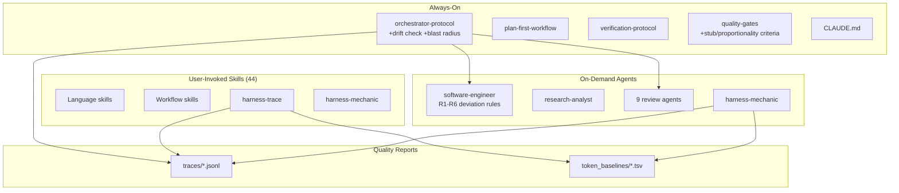

# ABOUTME: Project retrospective capturing architecture decisions, lessons, and gotchas
# ABOUTME: Living document updated after significant features, bugs, and integrations

# Claude Forge - Learning Documentation

## Project Overview

Claude Forge is a token-optimized three-tier harness for Claude Code: **rules** (always active), **agents** (on-demand reviewers), and **skills** (user-invoked domain knowledge). It started as a collection of markdown files and evolved into a structured system with quality gates, an orchestrator loop, vault integration, and a knowledge feedback cycle.

## Architecture

## Tech Stack & Decisions

| Technology | Why | Trade-offs |
|------------|-----|------------|
| Markdown-only harness | Zero dependencies, loads directly into context window | No programmatic validation; relies on LLM compliance |
| Pydantic for trace schema | Type-safe, auto-validation, great serialization | Adds Python dependency to what's otherwise pure markdown |
| tiktoken for token counting | Exact counts for Claude's tokenizer family | External dep, but already in Python stack |
| JSONL for traces | LLM-readable, appendable, one-line-per-step | No querying without parsing; fine for <100 sessions |
| Table-heavy markdown | Token-efficient, scannable | Less prose context; assumes reader knows the domain |

## Lessons Learned

### 2026-03-31: Meta-Harness - Automated Harness Optimization

**Context:** Read the Meta-Harness paper (arxiv 2603.28052, Stanford) which shows that automated optimization of LLM harnesses beats hand-engineering. Applied its concepts to claude-forge.

**Problem:** Our entire harness (rules, agents, skills) was hand-engineered with no measurement infrastructure. No way to know which rules actually help, which waste tokens, or where the orchestrator systematically fails.

**Solution:** Three-phase implementation inspired by Meta-Harness:

1. **Trace capture** (harness-trace skill): Python CLI that extracts structured JSONL traces from raw Claude Code session files. Heuristic parser identifies orchestrator steps (REFINE, IMPLEMENT, VERIFY, REVIEW, SCORE, etc.) from assistant message text.

2. **Token baselining** (same skill): tiktoken-based scanner that classifies every harness file by tier (always-on vs on-demand) and measures exact token consumption. First baseline revealed: 3,723 tokens always-on, 103,395 total.

3. **Harness mechanic** (new agent + skill): Reads traces and baselines, identifies systematic failure patterns (repeated step failures, score stuck below threshold, routing gaps), proposes evidence-based rewrites. Never auto-applies; always RED in decision framework.

**Takeaways:**

- **Gemini's reordering was right.** We initially planned eval loop first, but Gemini argued "you can't optimize what you can't measure." Reversing to traces -> measurement -> optimization was the correct call. The /second-opinion auto-trigger for complex decisions paid off here.

- **OTel is overkill for single-developer CLI tools.** Gemini caught this too: the trace consumer is an LLM agent reading a filesystem, not Grafana. Simple JSONL with flat structure is the right format.

- **Static compression > dynamic loading.** The paper's 4x token reduction came from the optimizer finding denser words, not from lazy-loading mechanisms. Claude Code manages its own context window; trying to inject dynamic loading would fight the tool.

- **Real sessions as benchmarks, not synthetic.** Gemini's key insight: if you optimize your Go skill using a benchmark of "build a ToDo app," the optimizer will ruthlessly delete advanced context. Use actual historical work for evaluation.

- **Gemini code review caught a real bug.** The multi-round step deduplication logic only allowed LOOP, FIX, and VERIFY to repeat across orchestrator rounds. But in a real multi-round loop, IMPLEMENT, REVIEW, and SCORE also repeat. The fix was trivial (apply count suffix to all steps), but the bug would have silently dropped trace data.

- **Token baseline as a health check.** The first baseline immediately shows where token budget goes. orchestrator-protocol.md at 1,075 tokens is the heaviest always-on file. blog-writer at 2,738 tokens is the heaviest skill. This data feeds directly into the harness-mechanic's optimization proposals.

## Pitfalls & Gotchas

- **Pydantic v2 can't instantiate BaseModel() directly.** We tried returning `BaseModel()` as a fallback for unknown step types. Pydantic v2 raises `PydanticUserError`. Return `None` instead.

- **ruff UP017 rule.** In Python 3.11+, `timezone.utc` should be `datetime.UTC`. Ruff catches this as auto-fixable, but it touches many files at once. Run `ruff check --fix` early.

- **Session JSONL format is undocumented.** Claude Code's internal session format (at `~/.claude/projects/`) has no official schema. The extractor's heuristic parsing is fragile by nature. We mitigate with: schema version field in traces, defensive JSON parsing, test fixtures from real sessions.

## Best Practices Discovered

- **"Measure before optimize" applies to harnesses too.** Don't hand-tune prompts by intuition. Build measurement infrastructure first, then let data guide changes.

- **Two-layer trace capture:** Rule-level emission (the orchestrator writes traces during execution) + post-processing extraction (a script parses raw sessions retroactively). The rule is authoritative; the script bootstraps the initial corpus and validates.

- **Knowledge-sync pattern transfers to harness optimization.** The SCAN -> FILTER -> GROUP -> PROPOSE -> APPROVE -> APPLY cycle from knowledge-sync works perfectly for the harness-mechanic. Same human-gated loop, different data source (traces instead of vault notes).

### 2026-04-05: Harness Hardening - Four Failure Modes from External Research

**Context:** Analyzed two sources: @systematicls article on long-running autonomous agent problems, and an internal "Judge Sub-Agent" proposal for context-efficient policy verification. Mapped both against our existing harness to find genuine gaps.

**Problem:** The harness had strong pre-task (refine-requirements) and post-task (review agents, quality gates) coverage, but three blind spots:
1. **Mid-implementation drift** went undetected: if subtask 1 deviated, subtask 2 built on wrong foundations (the "cascading A'" problem)
2. **Post-change entropy**: agents change function behavior but docs/tests/comments still reference old behavior. No mechanism to scan the blast radius.
3. **Complexity fear**: agents write stubs, declare things "out of scope," or silently delete complex code to simplify their task.

**Solution:** Four interventions, refined through `/second-opinion` with Gemini:

1. **R5: No Unplanned Stubs** (software-engineer agent). Gemini caught an important nuance: an absolute stub ban breaks TDD and interface-first development. The refined rule is "no *unplanned* stubs": if the plan says "deferred," stubs are fine. Also added "conservation of complexity": deleting >20% of a file or removing functions requires documented justification and a grep check for remaining callers.

2. **R6: Proportionality Guard** (software-engineer agent). Before destructive actions, verify necessity, scope proportionality, reversibility, and log justification. "Fix typo in README" should never trigger a directory restructure.

3. **Mid-Implementation Drift Check** (orchestrator step 1b). For multi-subtask work, spawn an isolated judge after each subtask. The judge sees ONLY the subtask description + git diff and answers: "Did we build exactly this, no more, no less?" Key design choice: the implementation agent cannot judge itself (confirmation bias in exhausted context).

4. **Blast Radius Check** (orchestrator step 5b, conditional). Triggers on: public API changes, >3 files changed, or schema changes. Cheap CLI pre-filter (grep for references to changed symbols), then fresh-context agent only for flagged files. Gemini pushed back on running it unconditionally: the grep pre-filter keeps token cost proportional to actual risk.

**Takeaways:**

- **"No unplanned stubs" > "no stubs."** Absolute rules sound clean but break legitimate workflows. Plan-aware rules preserve flexibility while still catching the failure mode (agent gives up silently).

- **Agent self-review is confirmation bias.** The article and the Judge proposal both converge on this: the agent that wrote the code shouldn't be the sole judge of its quality. Our existing review agents already embody this principle post-implementation. The drift check extends it to mid-implementation.

- **Cheap heuristics before expensive agents.** The blast radius check's grep pre-filter is a general pattern: use deterministic, token-free tools (grep, ast-grep, git diff) to narrow the search space before spending tokens on LLM review. Same principle as linters before code review.

- **Conservation of complexity is underrated.** The @systematicls article calls this "entropy maximization": agents change behavior without updating the surrounding context. But there's a subtler form: agents *delete* complexity they don't understand, making the codebase simpler-looking but functionally broken. The >20% deletion threshold with mandatory justification catches this.

- **External research validates internal architecture.** Most of the article's recommendations (requirements refinement, plan deviation detection, verification rigor) were already in our harness. The gaps were real but narrow: mid-implementation checks, blast radius, and anti-stub. The Judge Sub-Agent's core insight (context offloading) is already achieved by our fresh-context review agents. Reassuring that the architecture is sound; the improvements are refinements, not rewrites.
