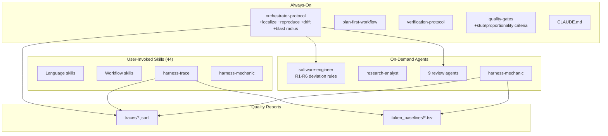

# ABOUTME: Project retrospective capturing architecture decisions, lessons, and gotchas
# ABOUTME: Living document updated after significant features, bugs, and integrations

# Claude Forge - Learning Documentation

## Project Overview

Claude Forge is a token-optimized three-tier harness for Claude Code: **rules** (always active), **agents** (on-demand reviewers), and **skills** (user-invoked domain knowledge). It started as a collection of markdown files and evolved into a structured system with quality gates, an orchestrator loop, vault integration, and a knowledge feedback cycle.

## Architecture

## Tech Stack & Decisions

| Technology | Why | Trade-offs |
|------------|-----|------------|
| Markdown-only harness | Zero dependencies, loads directly into context window | No programmatic validation; relies on LLM compliance |
| Pydantic for trace schema | Type-safe, auto-validation, great serialization | Adds Python dependency to what's otherwise pure markdown |
| tiktoken for token counting | Exact counts for Claude's tokenizer family | External dep, but already in Python stack |
| JSONL for traces | LLM-readable, appendable, one-line-per-step | No querying without parsing; fine for <100 sessions |
| Table-heavy markdown | Token-efficient, scannable | Less prose context; assumes reader knows the domain |

## Lessons Learned

### 2026-03-31: Meta-Harness - Automated Harness Optimization

**Context:** Read the Meta-Harness paper (arxiv 2603.28052, Stanford) which shows that automated optimization of LLM harnesses beats hand-engineering. Applied its concepts to claude-forge.

**Problem:** Our entire harness (rules, agents, skills) was hand-engineered with no measurement infrastructure. No way to know which rules actually help, which waste tokens, or where the orchestrator systematically fails.

**Solution:** Three-phase implementation inspired by Meta-Harness:

1. **Trace capture** (harness-trace skill): Python CLI that extracts structured JSONL traces from raw Claude Code session files. Heuristic parser identifies orchestrator steps (REFINE, IMPLEMENT, VERIFY, REVIEW, SCORE, etc.) from assistant message text.

2. **Token baselining** (same skill): tiktoken-based scanner that classifies every harness file by tier (always-on vs on-demand) and measures exact token consumption. First baseline revealed: 3,723 tokens always-on, 103,395 total.

3. **Harness mechanic** (new agent + skill): Reads traces and baselines, identifies systematic failure patterns (repeated step failures, score stuck below threshold, routing gaps), proposes evidence-based rewrites. Never auto-applies; always RED in decision framework.

**Takeaways:**

- **Gemini's reordering was right.** We initially planned eval loop first, but Gemini argued "you can't optimize what you can't measure." Reversing to traces -> measurement -> optimization was the correct call. The /second-opinion auto-trigger for complex decisions paid off here.

- **OTel is overkill for single-developer CLI tools.** Gemini caught this too: the trace consumer is an LLM agent reading a filesystem, not Grafana. Simple JSONL with flat structure is the right format.

- **Static compression > dynamic loading.** The paper's 4x token reduction came from the optimizer finding denser words, not from lazy-loading mechanisms. Claude Code manages its own context window; trying to inject dynamic loading would fight the tool.

- **Real sessions as benchmarks, not synthetic.** Gemini's key insight: if you optimize your Go skill using a benchmark of "build a ToDo app," the optimizer will ruthlessly delete advanced context. Use actual historical work for evaluation.

- **Gemini code review caught a real bug.** The multi-round step deduplication logic only allowed LOOP, FIX, and VERIFY to repeat across orchestrator rounds. But in a real multi-round loop, IMPLEMENT, REVIEW, and SCORE also repeat. The fix was trivial (apply count suffix to all steps), but the bug would have silently dropped trace data.

- **Token baseline as a health check.** The first baseline immediately shows where token budget goes. orchestrator-protocol.md at 1,075 tokens is the heaviest always-on file. blog-writer at 2,738 tokens is the heaviest skill. This data feeds directly into the harness-mechanic's optimization proposals.

## Pitfalls & Gotchas

- **Pydantic v2 can't instantiate BaseModel() directly.** We tried returning `BaseModel()` as a fallback for unknown step types. Pydantic v2 raises `PydanticUserError`. Return `None` instead.

- **ruff UP017 rule.** In Python 3.11+, `timezone.utc` should be `datetime.UTC`. Ruff catches this as auto-fixable, but it touches many files at once. Run `ruff check --fix` early.

- **Session JSONL format is undocumented.** Claude Code's internal session format (at `~/.claude/projects/`) has no official schema. The extractor's heuristic parsing is fragile by nature. We mitigate with: schema version field in traces, defensive JSON parsing, test fixtures from real sessions.

## Best Practices Discovered

- **"Measure before optimize" applies to harnesses too.** Don't hand-tune prompts by intuition. Build measurement infrastructure first, then let data guide changes.

- **Two-layer trace capture:** Rule-level emission (the orchestrator writes traces during execution) + post-processing extraction (a script parses raw sessions retroactively). The rule is authoritative; the script bootstraps the initial corpus and validates.

- **Knowledge-sync pattern transfers to harness optimization.** The SCAN -> FILTER -> GROUP -> PROPOSE -> APPROVE -> APPLY cycle from knowledge-sync works perfectly for the harness-mechanic. Same human-gated loop, different data source (traces instead of vault notes).

### 2026-04-05: Harness Hardening - Four Failure Modes from External Research

**Context:** Analyzed two sources: @systematicls article on long-running autonomous agent problems, and an internal "Judge Sub-Agent" proposal for context-efficient policy verification. Mapped both against our existing harness to find genuine gaps.

**Problem:** The harness had strong pre-task (refine-requirements) and post-task (review agents, quality gates) coverage, but three blind spots:
1. **Mid-implementation drift** went undetected: if subtask 1 deviated, subtask 2 built on wrong foundations (the "cascading A'" problem)
2. **Post-change entropy**: agents change function behavior but docs/tests/comments still reference old behavior. No mechanism to scan the blast radius.
3. **Complexity fear**: agents write stubs, declare things "out of scope," or silently delete complex code to simplify their task.

**Solution:** Four interventions, refined through `/second-opinion` with Gemini:

1. **R5: No Unplanned Stubs** (software-engineer agent). Gemini caught an important nuance: an absolute stub ban breaks TDD and interface-first development. The refined rule is "no *unplanned* stubs": if the plan says "deferred," stubs are fine. Also added "conservation of complexity": deleting >20% of a file or removing functions requires documented justification and a grep check for remaining callers.

2. **R6: Proportionality Guard** (software-engineer agent). Before destructive actions, verify necessity, scope proportionality, reversibility, and log justification. "Fix typo in README" should never trigger a directory restructure.

3. **Mid-Implementation Drift Check** (orchestrator step 1b). For multi-subtask work, spawn an isolated judge after each subtask. The judge sees ONLY the subtask description + git diff and answers: "Did we build exactly this, no more, no less?" Key design choice: the implementation agent cannot judge itself (confirmation bias in exhausted context).

4. **Blast Radius Check** (orchestrator step 5b, conditional). Triggers on: public API changes, >3 files changed, or schema changes. Cheap CLI pre-filter (grep for references to changed symbols), then fresh-context agent only for flagged files. Gemini pushed back on running it unconditionally: the grep pre-filter keeps token cost proportional to actual risk.

**Takeaways:**

- **"No unplanned stubs" > "no stubs."** Absolute rules sound clean but break legitimate workflows. Plan-aware rules preserve flexibility while still catching the failure mode (agent gives up silently).

- **Agent self-review is confirmation bias.** The article and the Judge proposal both converge on this: the agent that wrote the code shouldn't be the sole judge of its quality. Our existing review agents already embody this principle post-implementation. The drift check extends it to mid-implementation.

- **Cheap heuristics before expensive agents.** The blast radius check's grep pre-filter is a general pattern: use deterministic, token-free tools (grep, ast-grep, git diff) to narrow the search space before spending tokens on LLM review. Same principle as linters before code review.

- **Conservation of complexity is underrated.** The @systematicls article calls this "entropy maximization": agents change behavior without updating the surrounding context. But there's a subtler form: agents *delete* complexity they don't understand, making the codebase simpler-looking but functionally broken. The >20% deletion threshold with mandatory justification catches this.

- **External research validates internal architecture.** Most of the article's recommendations (requirements refinement, plan deviation detection, verification rigor) were already in our harness. The gaps were real but narrow: mid-implementation checks, blast radius, and anti-stub. The Judge Sub-Agent's core insight (context offloading) is already achieved by our fresh-context review agents. Reassuring that the architecture is sound; the improvements are refinements, not rewrites.

### 2026-04-09: Atomic Skills Integration - From RL Paper to Prompt Orchestrator

**Context:** Read "Scaling Coding Agents via Atomic Skills" (arxiv 2604.05013), which decomposes coding agent work into 5 atomic skills (localization, editing, test_generation, reproduction, review) and trains a single RL policy jointly on all five, achieving +18.7% on composite tasks. Adapted the concepts to our prompt-based orchestrator.

**Problem:** Our orchestrator traces captured step-level data (IMPLEMENT succeeded/failed) but couldn't answer "which fundamental capability failed?" If IMPLEMENT fails, is it because the agent edited the wrong files (localization) or wrote bad patches (editing)? This distinction was invisible. Also, bug-fix reproduction was embedded in the TDD process with no explicit tracing, and we had no framework for understanding how skill deficiencies cascade into composite task failures.

**Solution:** Four changes, refined through two /second-opinion rounds with Gemini:

1. **Skill metrics in trace data models.** Instead of binary skill tags (Gemini's first-round feedback: "noisy, overlapping"), we added continuous metrics to existing step data models: `localization_precision` on ImplementData, `reproduction_confirmed` on VerifyData, `review_validity` (% of CRITICAL+MAJOR findings addressed) on ReviewData. Also added `files_actually_changed` to LocalizeData (Gemini's second-round feedback: plan is hypothesis, git diff is ground truth).

2. **Localization sub-protocol (step 1a).** Engineer outputs `files_to_edit` list before editing. Orchestrator validates against plan scope (precision/recall). Not a separate agent spawn (Gemini's first-round pushback: "massive token waste for +7.1% ceiling"), but an in-band structural check within IMPLEMENT.

3. **Issue reproduction step (step 1b).** Explicit traced step for bug-fix tasks. Two-phase verification: script fails before fix (verified immediately), script passes after fix (verified during VERIFY). Gemini's second-round caught the ordering: reproduction must come *after* localization, since the agent needs to know which files/entry points to target.

4. **Skill composition map in harness-mechanic.** Advisory heuristic (not prescriptive) mapping task types to atomic skill sequences. Enables cascade analysis: "localization weak across 3 sessions" instead of "IMPLEMENT keeps failing."

**Takeaways:**

- **RL concepts transfer to prompt systems, but the abstraction layer changes.** The paper's atomic skills are RL reward vectors (binary pass/fail). In a prompt orchestrator, the same skills need to be *observable metrics* in traces. Binary tags are too coarse; continuous precision/recall/confirmation signals give the harness-mechanic much richer diagnostic data.

- **Two /second-opinion rounds caught three real issues.** Round 1 (pre-implementation): "LOCALIZE as separate agent spawn is token waste, use in-band check." Round 2 (post-implementation): "plan is not ground truth, use git diff; review_validity should exclude MINOR; REPRODUCE must come after LOCALIZE." All three were correct and improved the design. The auto-trigger on complex decisions continues to pay for itself.

- **Advisory heuristics > prescriptive maps.** The composition map (bug-fix = localization -> reproduction -> editing -> ...) is useful as a diagnostic lens for the harness-mechanic, but tasks in the wild blend categories. Gemini was right to push for "advisory" over "prescriptive."

- **Existing architecture absorbed the changes cleanly.** Four new Pydantic models, two new orchestrator sub-steps, one new mechanic pattern. No existing tests broke (45/45 pass). The trace schema's `dict[str, Any]` data field and Optional typing made backward compatibility a non-issue. Good sign that the v1 schema was designed with extensibility in mind.

### 2026-04-18: Opus 4.7 Tuning + Fourth Tier (Enforcement Layer)

**Context:** Received Opus 4.7 (post-4.6 release). The whole harness had been written for 4.6. Also got a suggestion for a four-tier architecture separating identity/skills/extensions, where the extension layer makes rules "model-proof". Long session re-tuning skills, the orchestrator protocol, and the enforcement machinery around it.

**Problem:** Three distinct problems that merged into one sprawling session.

1. Skills and orchestrator-protocol over-explained things 4.7 already knows: per-version feature enumerations ("Modern Go 1.22+..."), tutorial-style explanations of SOLID / N+1 / injection, didactic examples of canonical patterns. Plus: all language skill descriptions pinned specific versions (React 19, Kotlin 2.x, Swift 6) that would invecchia in months.
2. Rules in `rules/*.md` are prompt-level instructions. Claude can forget them under context pressure. "Always run `make check` before commit", "never commit to main", "add ABOUTME to new files": all fragile as prose.
3. Agent routing (architecture-reviewer, security-reviewer, etc.) described in `orchestrator-protocol.md` is prescriptive text. Empirically, across 89 session transcripts, review agents are under-invoked (general-purpose fallback appears 17 times; dependency-reviewer only 3). The flow exists on paper, not in practice.

**Solution:**

1. **Skill and orchestrator slim.** Removed version pins everywhere, replaced with a "Version (determine, don't assume)" section instructing Claude to fetch the actual version (`go version`, `curl -s https://go.dev/VERSION?m=text`, `npm view react version`). Dropped per-version "What's New" tables. Consolidated orchestrator sub-protocols (1a LOCALIZE, 1b REPRODUCE, 1c DRIFT) into a single table. Made Blast Radius trigger mechanical (ast-grep instead of "public API" judgment). Global 5-round ceiling across REVIEW+UAT with explicit escalation. Two rounds of `/second-opinion` with isolated Docker reviewers caught fragility issues I missed: dead LOCALIZE skip rule covered by entry gate, "file scopes disjoint" not accounting for shared integration surfaces, DRIFT over-restrictive on parallel subtasks, plan-checkpoint gap with plan-first-workflow.

2. **Enforcement layer.** Built five hooks that enforce the main rules mechanically:
   - `pre-commit-gate.sh`: `make check && make test-e2e` must pass before any `git commit`.
   - `main-branch-guard.sh`: blocks commits on `main`/`master`.
   - `aboutme-enforcer.py`: blocks `Write` of source files without 2 `# ABOUTME:` (or `// ABOUTME:`) lines, warns on Edit regressions.
   - `routing-advisor.py`: after each Write/Edit/MultiEdit/Agent, matches touched files against a routing table and emits a reminder via `additionalContext` to invoke the right reviewer. Per-session deduplication via state file.
   - `commit-intent-guard.py`: Tier A of a tiered intent check. Blocks non-conventional commit messages, blocks unfinished-work markers (TODO/FIXME/NotImplementedError), advises on unplanned deletions.
   Plus path-protection deny rules (`.git/hooks`, `~/.ssh`, credentials) in `permissions.deny`.

3. **Routing fix via observable nudge.** Hooks cannot spawn Agent calls directly, so routing enforcement becomes: hooks observe file modifications and inject `additionalContext` reminders. Claude sees the reminder in the next turn and chooses to invoke the reviewer. Not true enforcement, but moves routing from prose to data (inline routing table in `routing-advisor.py`), deduped per session so no spam.

4. **Tiered strategy with a measurement gate.** commit-intent-guard is Tier A (mechanical only). Tier B (single LLM semantic check) and Tier C (agent-type hook comparing diff vs plan intent) are deferred. Built `scripts/metrics-weekly.sh` to measure revert rate, fix-up rate, and median time-to-next-touch. Two weeks baseline, then re-measure with Tier A active: if metrics improve, stay put; if not, escalate.

**Takeaways:**

- **Version pins are a bug.** Every skill description that said "Swift 6" or "Kotlin 2.x" was a time bomb. 4.7 knows Swift 7 already; 4.8 will know Swift 8. The fix is not updating the pin, it is removing the pin and fetching the truth at runtime. Same for any fact that changes on a schedule.

- **Hooks catch what prose misses.** The hooks fired against their own creator within this session: the aboutme-enforcer blocked a Write of a memory file that lacked ABOUTME (frontmatter-only convention, had to exempt the path); the commit-intent-guard blocked its own commit twice (heredoc extraction bug, self-detection of regex strings). Every false positive exposed a gap in the design. Building the enforcement layer was itself the best test of it.

- **Self-detection bug in commit-intent-guard v1: a meta-problem.** The original scanner flagged TODO/FIXME/NotImplementedError appearing anywhere in the diff. But the scanner code itself contains those strings (as regex patterns, as error labels, as the skill's own documentation). The fix required scope-aware detection: skip `.md` and `/docs/` paths entirely; for code files, flag TODO/FIXME/XXX only in comment context (starts with `#`/`//` or has inline ` #`/` //`), not inside string literals; flag `raise NotImplementedError` only as a statement match, not as a string. Lesson: every detector that defines its own patterns in prose is susceptible to self-matching; scope scanning by file type and context is mandatory.

- **Empirical diagnosis beat intuition.** My first proposal for improving review agents was content-level tuning (evidence schema, context injection). Checking the session transcripts revealed the real problem was routing: agents rarely got invoked. Seven reviewer types in 89 sessions: architecture 21, security 16, dependency 3, database 4, test 7. Without that data, I would have improved the wrong thing.

- **Measurement before escalation.** Max pushed back on jumping to Tier C (full agent LLM check) without evidence. The tiered strategy (A first, measure, escalate only on failure) ended up simpler, cheaper, and more honest. `metrics-weekly.sh` is the kill-switch for hope-based architecture.

- **uv-always was a late but sharp correction.** Mid-session Max said "usa sempre uv per piacere." Makefile invocations like `python3 scripts/check.py` switched to `uv run --no-project python3 scripts/check.py`. Reason: consistent Python entry point, no shadow environments. Saved in MEMORY as `[LEARN:python]`.

- **AGENTS.md symlink is cheap portability.** A relative symlink from `~/.claude/AGENTS.md` to `CLAUDE.md` lets both Claude Code (which reads CLAUDE.md) and tools that adopt the emerging AGENTS.md convention see the same content. One `ln -s`, zero duplication. install.sh now creates it.

- **Second-opinion with Docker isolation caught real issues prose-review missed.** Rewrote `/second-opinion` to spawn both Claude and Gemini as Docker containers with no access to `~/.claude` config or memories. Genuinely independent opinions (two rounds on the orchestrator protocol) surfaced bugs I had just written: dead skip rules, plan-checkpoint gap, over-restrictive DRIFT. Isolation is the point; they cannot confirm confirmation bias.

### 2026-07-04: Harness Engineering Day - Four Articles, One Audit, Eleven PRs

Read four harness-engineering pieces in one sitting (OpenAI's agent-first post, the Codex ExecPlans cookbook, Fowler/Böckeler's guides-and-sensors taxonomy, LangChain's Terminal Bench climb), mapped them against the forge, then ran a four-auditor parallel review of every skill and hook. Merged PRs #38-#48 the same evening and flipped the runtime to the repo.

- **The meta-lesson was one sentence: copies drift, references don't.** Almost every audit finding had the same shape. The deployed `~/.claude/skills` tree had drifted from the repo in BOTH directions (mauro-blogger existed only deployed and unversioned; blog-writer's deployed copy pointed at a vault folder that doesn't exist, while the repo value was correct). pr-review had re-inlined the routing and threshold tables from the rules and both copies had already diverged. email-cleanup had inlined a Gmail command instead of referencing `_GMAIL.md` and rotted to a flag (`--remove-labels`) that doesn't exist. Seven language skills carried the same 30 lines of prose, drifting independently. The articles preach this (OpenAI: "give the agent a map, not a manual"); the audit proved it empirically in our own tree. Fix direction everywhere: one source of truth plus pointers, and `~/.claude/skills` is now a symlink.

- **`git -C <path> commit` bypassed all four commit gates.** The trigger regex `git\s+commit` never matched the `-C` form, so cross-repo commits ran completely ungated. The tell, in hindsight: `_commit_target.sh` contained `git -C` parsing logic that was DEAD CODE, because the gates never fired for that form. If a helper handles a case the caller can never reach, someone assumed the case worked. Now regression-tested (16 cases).

- **Four skills were advertising the wrong description to the registry.** `# ABOUTME:` lines above the YAML frontmatter make the skill registry publish the ABOUTME as the description and discard the authored trigger phrases. Confirmed live: the session's own skill list showed the ABOUTME text. Two more were worse (autoresearch-prompt had no `description:` key at all, linkedin-post had no frontmatter): both effectively didn't exist at runtime, and newsletter-digest depended on one of them. A `frontmatter first` lint in `make check` now pins the whole class.

- **Confidently-wrong API docs are worse than no skill.** swiftui-liquid-glass taught an invented `glassEffect(intensity:style:interactive:)` API; ios-debugger taught `simctl io tap/type/swipe` subcommands that don't exist. Both plausible, both fabricated, both would burn any session that trusted them. Verified the real signatures against Apple's doc JSON endpoint and rewrote; both files now carry a "if a parameter is not listed here, fetch the docs" line. Skill content that states an API is a liability unless it was verified on write.

- **Our own guard denied the exact pattern its deny message recommends.** main-branch-guard says "create a feature branch first: `git checkout -b feat/<slug>`", then denied `git checkout -b X && git commit` launched from main, because PreToolUse evaluates before the checkout runs. Found it live when the gitignore chore commit bounced. Fixed by honoring the chain's target branch (scanning only the text BEFORE the first `git commit`, so commit messages can't spoof it) and verified live on the very next docs commit.

- **Adversarial review of freshly-written hooks paid immediately, twice.** The architecture reviewer found that sidechain `user` lines advance the turn boundary in verify-before-stop, silently disabling the gate in exactly the subagent-heavy sessions it matters for. The next round found doom-loop-detector trusting its own state file (tampered non-int values crashed it) and writing to world-writable /tmp. Fresh-context reviewers on code written minutes earlier are not ceremony; they found the two bugs I was structurally blind to.

- **The auto-mode classifier drew a line worth keeping: runtime self-modification needs fresh explicit authorization.** "pusha e mergia, vai avanti su tutto" covered the repo, but repointing `~/.claude/skills` and editing `settings.json` got blocked as self-modification until Max re-authorized in so many words. Right call: the same mechanism that protects against prompt injection protects against an over-eager agent rewiring its own harness on an inferred mandate.

- **LangChain's numbers justified the two new hooks.** Their single highest-impact harness change (+13.7 Terminal Bench points overall) was forcing a verification pass before completion; ours is verify-before-stop (one nudge per turn, `git commit` counts because the pre-commit gate runs the suite). Their LoopDetectionMiddleware became doom-loop-detector (advisory at edit #5). Both fail open, both tested, both carried falsifiable contracts: if they turn out to be noise, the contracts say exactly when to unregister them.

### 2026-07-06: Three second-opinions to build one small tool - the design-review blind spot

A single feature (an always-fresh "code map" to orient agents in a repo) took three full `/second-opinion` rounds to land, and each round made it *smaller*. The final shipped design is less code than any intermediate version. The story is really about the gap between line-review and design-review.

- **Two rounds of line-level review passed a design that violated the harness's core principle.** The first code-map version committed a generated `CODEMAP.md` into each repo, stamped with the generating commit, regenerated by a hook on every commit. Architecture-reviewer and test-reviewer both reviewed it, found real bugs, and passed it. Then `/second-opinion` (three isolated models, asked the *architectural* question instead of "is this code correct") unanimously shredded it: a committed generated file is stale the instant anyone edits without committing, i.e. for the whole session, which is exactly when the map is read. I had shipped a stale-evidence-*rejecting* hook (score-evidence-guard) and a stale-*by-construction* artifact **on the same day** and not noticed. Takeaway: file reviewers check "is this code correct"; they do not check "does this design contradict a principle I hold." For a load-bearing design decision, run the second-opinion on the *decision*, ideally before writing code, not just the file reviewers on the diff.

- **The reviewers found a structural bug neither line-reviewer did: two hooks fighting into a steady state.** The commit-time regen and the session-start freshness advisory, each correct alone, combined into "map always one commit behind, working tree always dirty, advisory crying wolf every session." Nobody caught it because each file reviewer looked at one file. Emergent misbehavior lives in the seams between components, which is precisely what single-file review cannot see.

- **Fixtures were green while real code exposed two real bugs.** The generator's tests passed on hand-built fixtures, but running it against real work repos before committing anything caught: a monorepo where hundreds of endpoints buried the workspace list (fixed by ranking workspaces above endpoints), and a frontend whose Next.js app dir lived under `src/app`, not `app` (0 routes → 48). Validating extraction against real, messy code is not optional polish; it is where the bugs are. Committing an empty or wrong map into a repo would have been the same silent-wrongness the whole effort exists to prevent.

- **Prior art beat invention, and I reinvented it worse first.** aider's repo-map is ephemeral (per-session) and ranked by reference centrality, and is *not* committed. My first design committed a truncated flat list. Each review round dragged the design back toward aider's proven shape: committed → ephemeral → on-demand; regen+freshness hooks → one nudge; cache → no cache; skill/MCP → a plain CLI command. When a mature tool already solved your problem, the burden is on you to justify *not* copying its shape.

- **The third round disagreed on the mechanism, and the disagreement was the signal.** Asked "skill vs MCP tool vs CLI," the three models split three ways (skill / CLI / MCP). But underneath they agreed on everything that mattered: drop the cache (on-demand generation is masked by inference latency), the nudge is load-bearing (a passive command is invisible), and the mechanism should be whatever is lowest-indirection. The CLI won as the Condorcet choice: a command the agent runs via its native Bash tool is single-turn and zero-registration, where a skill is 2-turn indirection and an MCP server is overkill for a stateless 180ms script. When reviewers disagree on the surface, look for the layer where they agree.

- **`--print` to stdout deleted a whole bug class for free.** Once the map is generated on demand and printed rather than persisted, the slug-collision, atomic-write, and cache-staleness problems the *second* round had found all vanished by construction. The cheapest fix for a class of storage bugs was to stop storing. The general move: when a design keeps sprouting bugs around an artifact's lifecycle, question whether the artifact needs to exist at all.

- **The evidence-integrity lesson, imported and then dogfooded.** The day opened by importing a "two-confirmation gate" from a sister harness (a quality SCORE is valid only alongside fresh computational evidence, not the model's prose) as the score-evidence-guard hook. The three review rounds were the same principle turned on my own work: a design's stated goals are prose; whether it *holds* is evidence, and the evidence here was three independent models converging. "Evidence over eloquence" applies to your own architecture, not just the agent's test claims.
