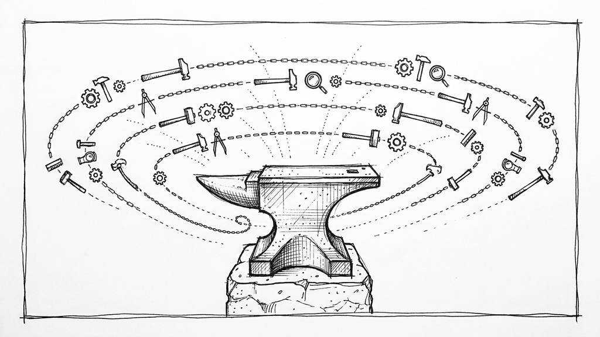

# Claude Forge



Token-optimized skills, orchestrated review agents, always-on workflow rules, and a deterministic enforcement layer for Claude Code. Four-tier system:

- **Identity / rules** (always active, pure prose): `CLAUDE.md` + `rules/*` define who Claude is and how it works.
- **Agents** (on-demand reviewers): launched by the orchestrator per file patterns.
- **Skills** (user-invoked): progressive disclosure for languages, tools, and personal workflows.
- **Extensions / hooks** (runtime, model-proof): `Makefile` gates, git-commit guards, ABOUTME enforcer, path protection. Text tells Claude what to do; hooks make sure it happens.

Tuned for Claude Opus 4.8 (effort-aware subagents, no stale version pins, no redundant didactics, fetch-don't-assume for language versions).

## Quick Start

**Option 1: One-liner (recommended)**
```bash
curl -sL https://raw.githubusercontent.com/maroffo/claude-forge/main/get.sh | bash
```

Clones the repo to `~/.claude-forge`, then runs the interactive installer. Pick skill categories, enter your name/paths/email, and it copies everything to `~/.claude/` with personalized values. Safe to re-run (backs up existing files, pulls latest on re-run).

**Option 2: Symlink (for contributors)**
```bash
git clone https://github.com/maroffo/claude-forge.git ~/Development/claude-forge

# Backup and symlink
mv ~/.claude/skills ~/.claude/skills.backup
ln -s ~/Development/claude-forge/skills ~/.claude/skills

mv ~/.claude/agents ~/.claude/agents.backup 2>/dev/null
ln -s ~/Development/claude-forge/agents ~/.claude/agents

mv ~/.claude/rules ~/.claude/rules.backup 2>/dev/null
ln -s ~/Development/claude-forge/rules ~/.claude/rules

mv ~/.claude/CLAUDE.md ~/.claude/CLAUDE.md.backup
ln -s ~/Development/claude-forge/CLAUDE.md.example ~/.claude/CLAUDE.md
```

**Option 3: Manual copy**
```bash
git clone https://github.com/maroffo/claude-forge.git
cp -r claude-forge/skills/* ~/.claude/skills/
cp -r claude-forge/agents/* ~/.claude/agents/
cp -r claude-forge/rules/* ~/.claude/rules/
cp claude-forge/CLAUDE.md.example ~/.claude/CLAUDE.md
```

## Architecture

```
~/.claude/
├── CLAUDE.md           → Identity, philosophy, routing tables
├── AGENTS.md           → Symlink to CLAUDE.md (emerging cross-tool convention)
├── MEMORY.md           → Persistent [LEARN:x] corrections
├── rules/              → Always-on workflow guardrails (auto-loaded)
├── agents/             → On-demand agents (launched by orchestrator)
├── skills/             → User-invoked language/tool skills
├── hooks/              → PreToolUse/PostToolUse/SessionEnd enforcement scripts (local, not in repo)
├── settings.json       → Hook registration + path-protection deny rules
├── docs/solutions/     → Categorized solved problems (searchable knowledge base)
│
claude-forge repo
├── Makefile            → `make check` + `make test-e2e` (pre-commit gate)
├── scripts/            → check_repo.py (ABOUTME, em-dashes, frontmatter, schema)
├── hooks/              → Source for the enforcement hooks (installed to ~/.claude/hooks/)
├── quality_reports/    → traces/ (gitignored), token_baselines/ (gitignored), harness_changes/ (committed audit trail)
│
Obsidian Vault (Documents/)
├── Projects/           → Per-project artifacts (overview, log, solutions)
├── Plans/              → Cross-project plan mirrors (source of truth: repo `quality_reports/plans/`)
└── Second Brain/       → Topic files with Skill Candidates for knowledge-sync
```

**Rules** auto-load every conversation — no invocation needed.
**Agents** are launched by the orchestrator based on which files changed.
**Skills** activate based on project context or user invocation.

**Effort, not model downgrade, is the cost lever.** The main session runs at `xhigh` (`effortLevel` in `settings.example.json`, Anthropic's coding/agentic recommendation for Opus 4.8). Each subagent pins its own `effort:` in frontmatter: review agents and research at `medium`, harness-mechanic at `high`, project-analyzer at `low` (plus `model: haiku`), software-engineer omits `effort:` to inherit the session. Opus 4.8 recalibrated effort (`high` thinks less, `xhigh` more), so these are 4.8 baselines, not ported 4.7 values. Override any session or task with `/effort`. See `rules/orchestrator-protocol.md`.

## Rules (Always Active)

| Rule | Purpose |
|------|---------|
| `orchestrator-protocol` | Contractor mode: research → localize → reproduce (bug-fix) → implement → verify → review → fix → score → loop (global 5-round ceiling, then escalate). Atomic skill metrics in traces for cascade analysis. |
| `plan-first-workflow` | Requirements refinement, append-only decisions register, checkpoints, context preservation ("never summarize summaries") |
| `verification-protocol` | TDD process, mandatory test/lint/build cycle, outcome verification tables |
| `quality-gates` | Scoring: 80 commit, 90 PR, 95 excellence |

## Enforcement Layer (Hooks + Gates)

Text in rules tells Claude what to do; the enforcement layer makes sure it happens even if Claude forgets. Hook scripts ship in `hooks/` and are copied to `~/.claude/hooks/` by `install.sh`.

The matching settings fragment lives at [`hooks/settings.example.json`](hooks/settings.example.json): registration for all enforcement hooks plus the `permissions.deny` path-protection rules. `install.sh` renders it at install time (replacing `{{HOOKS_DIR}}` with the real path) and prints it for a manual merge into `~/.claude/settings.json`. Merge stays manual to avoid clobbering user-specific config.

| Mechanism | Trigger | What it does |
|-----------|---------|--------------|
| `pre-commit-gate.sh` | PreToolUse on `git commit` | Runs `make check && make test-e2e`, blocks on failure or missing targets (points to `/project-checks`) |
| `main-branch-guard.sh` | PreToolUse on `git commit` | Refuses commits directly on `main`/`master` |
| `commit-intent-guard.py` | PreToolUse on `git commit` | Tier A intent checks: conventional-message regex (block), TODO/FIXME/NotImplementedError/placeholder in ADDED lines (block), unplanned file deletions (advisory) |
| `gitignore-anchor-lint.py` | PreToolUse on `git commit` | Advisory: flags newly-added bare-name `.gitignore` lines that match a tracked directory (suggests anchoring with `/`), and `.env.*` globs missing a `!.env.example` negation. Never blocks |
| `aboutme-enforcer.py` | PreToolUse Write (block), PostToolUse Edit (advisory) | Requires 2 `# ABOUTME:` (or `// ABOUTME:`) lines on new source files; detects ABOUTME removals on edits. Exempts lock files, vendored/generated paths, uncommentable formats |
| `routing-advisor.py` | PostToolUse Write/Edit/MultiEdit/Agent | Matches touched file paths against a routing table and nudges Claude via `additionalContext` to invoke the right reviewer (dependency-reviewer on `go.mod`, database-reviewer on migrations, etc.). Deduplicates per-session |
| `session-end-trace.py` | SessionEnd | No-op outside claude-forge cwd. Otherwise auto-runs `harness-trace extract` against the session's transcript and writes the result under `quality_reports/traces/<date>_<session_id>.jsonl`. Closes the loop for the `harness-mechanic` Evolution Agent (see [Telemetry](#telemetry)) |
| Path protection | `permissions.deny` in settings.json | Blocks edits to `.git/hooks/`, `~/.ssh/`, `~/.aws/credentials`, gcloud/gemini keys, `id_rsa`/`id_ed25519` |

The repo ships `Makefile` + `scripts/check_repo.py` implementing `make check` (ABOUTME, em-dashes scoped to `skills/`, frontmatter) and `make test-e2e` (skill schema smoke).

`scripts/metrics-weekly.sh` computes three signals to decide whether the enforcement is working: revert rate, fix-up rate, median time-to-next-touch. Run it as a baseline, apply enforcement, re-run after two weeks. If drift indicators don't drop, upgrade Tier A to Tier B (semantic check) or Tier C (full LLM agent).

## Telemetry

If enforcement is "make Claude follow the rules", telemetry is "see what Claude actually did". Two skills, one rule, one hook, all driven by arxiv 2605.18747 §3.5 (Agentic Harness Engineering).

| Piece | Where | What it does |
|-------|-------|--------------|
| `harness-trace` skill | `skills/harness-trace/` | Parses a session JSONL into structured trace entries (schema v2). Tool-use blocks are the primary signal; text regex is fallback. Computes 6-dimension `HarnessMetrics` in the synthetic `SUMMARY` step (paper §5.2.1) |
| `session-end-trace.py` hook | `hooks/`, fired on `SessionEnd` | Auto-runs `harness-trace extract` on every session that ends with cwd inside claude-forge. Output: `quality_reports/traces/<date>_<session_id>.jsonl`. Fail-silent, non-blocking |
| `harness-mechanic` skill | `skills/harness-mechanic/` | Evolution Agent (paper §3.5.2) that reads accumulated traces, baselines, and prior change contracts; runs the 5-stage Observe-Diagnose-Propose-Evaluate-Promote loop; outputs proposals each carrying a draft change contract |
| `rules/harness-changes.md` | `rules/` | Any non-trivial edit to `hooks/`, `rules/`, `skills/`, `agents/`, or `settings*.json` must be preceded by a six-field change contract (Component / Failure mode / Predicted improvement / Invariants / Falsification / Rollback). Template under `quality_reports/harness_changes/` |

Trace JSONL and token baselines under `quality_reports/` are gitignored (`quality_reports/traces/*.jsonl`, `quality_reports/token_baselines/*.tsv`): they are local-only, regenerated continuously by the hook. Change contracts in `quality_reports/harness_changes/*.md` ARE committed: they are the audit trail of harness mutations.

### Getting traces

1. Run `install.sh` (copies `session-end-trace.sh` + `.py` into `~/.claude/hooks/`).
2. Merge the printed `SessionEnd` block into `~/.claude/settings.json` (the installer prints the full hooks/permissions fragment at the end).
3. Open a session in claude-forge and do real work. On `/exit`, Ctrl-C, or window close the hook fires automatically.
4. Inspect `quality_reports/traces/<date>_<session_id>.jsonl`. To regenerate a token baseline: `cd skills/harness-trace && uv run -- harness-trace baseline --base-dir <repo-root> -o <repo-root>/quality_reports/token_baselines/`.

The hook is no-op outside claude-forge: opening Claude Code in another project does not touch this directory.

## Agents (On-Demand)

Launched by the orchestrator based on file patterns. All review agents are **read-only** (report findings, never edit).

| Agent | Trigger | Role |
|-------|---------|------|
| `software-engineer` | Implementation subtasks, fix rounds | Scoped read-write, deviation rules (R1-R6), incremental commits |
| `research-analyst` | Pre-plan unknowns, tech evaluation | Best practices, external repos, docs, prior art |
| `security-reviewer` | Auth, input, API, secrets | OWASP, injection, credentials |
| `performance-reviewer` | Hot paths, queries, caching | N+1, memory, allocations |
| `architecture-reviewer` | Multi-file, new features | SOLID, coupling, API design |
| `test-reviewer` | Test files, pre-PR | Coverage gaps, flaky patterns |
| `dependency-reviewer` | go.mod, Gemfile, package.json | CVEs, licenses, outdated |
| `database-reviewer` | Migrations, schema | Lock safety, indexes, deadlocks |
| `dx-reviewer` | Docs, README, ADR | Documentation, error messages, onboarding |
| `tech-writer` | Post-milestone | Blog posts, changelogs, release notes |
| `project-analyzer` | New codebases | Generate CLAUDE.md documentation |
| `harness-mechanic` | Trace analysis, weekly/on-demand | Evidence-based harness optimization, atomic skill cascade analysis |

## Skills

Skills are markdown files that teach Claude domain-specific patterns. They load automatically when relevant or on demand via `/skill-name` in Claude Code.

**How invocation works:**
- Type `/obsidian` to activate the Obsidian vault skill
- Type `/commit` to use the source-control commit workflow
- Type `/knowledge-sync` to run the vault-to-skills sync
- Some skills auto-activate based on project context (e.g., `golang/` loads when working in a Go project)

**Shared reference files** (`_*.md`) are not invocable. They provide configuration and patterns that other skills reference internally.

### Languages & Frameworks

| Skill | Description |
|-------|-------------|
| `golang/` | Go conventions, architecture, concurrency, performance |
| `python/` | uv, type checking, ruff, pytest, Docker |
| `rails/` | Service-oriented Rails, Dry-validation, Sidekiq, Hotwire |
| `ruby/` | Gem development, RSpec, RuboCop, publishing |
| `terraform/` | IaC patterns, modules, Terragrunt, OpenTofu |
| `react-nextjs/` | React + Next.js App Router, Server Components (version via `npm view`) |
| `android-kotlin/` | Kotlin, Jetpack Compose, Clean Architecture (version via `./gradlew`) |
| `apple-swift/` | Swift, SwiftUI, async/await, concurrency (version via `swift --version`) |
| `swiftui-liquid-glass/` | iOS 26+ Liquid Glass API |
| `ios-debugger/` | Build, run, debug iOS apps via CLI (Xcode + Simulator) |
| `cloud-infrastructure/` | AWS/GCP Well-Architected, security, cost, observability |

Large skills use a `references/` subdirectory for detailed patterns (progressive disclosure: core in SKILL.md, details on demand). Currently: `android-kotlin/`, `apple-swift/`, `bujo-sync/`, `golang/`, `humanizer/`, `python/`, `rails/`, `react-nextjs/`, `ruby/`.

### Shared Reference Files

| File | Description |
|------|-------------|
| `_AST_GREP.md` | Structural code search (mandates ast-grep over grep) |
| `_INDEX.md` | Quick skill lookup by language/task |
| `_PATTERNS.md` | Cross-language patterns (DI, errors, testing, jobs) |
| `_GMAIL.md` | Gmail account config, gog CLI commands |
| `_OBSIDIAN.md` | Obsidian CLI config, vault commands |
| `_SECOND_BRAIN.md` | Category routing, content templates, rules |
| `_VAULT_CONTEXT.md` | Vault context injection, token budget, breadcrumbs |
| `_generate_image.py` | Gemini image generation (used by cover-image, table-image) |

### Support & Integrations

| Skill | Description |
|-------|-------------|
| `source-control/` | Conventional commits, git workflow, hooks |
| `commit/` | Redirects to `source-control/` |
| `score/` | Run `make check` + `make test-e2e` and report commit/PR/excellence readiness |
| `project-checks/` | Scaffold a Makefile with language-specific check/test-e2e targets |
| `learning-docs/` | LEARNING.md retrospectives, session analysis, docs/solutions/ capture, vault pattern annotation |
| `knowledge-sync/` | Vault-to-skills sync: scan Second Brain for recurring patterns, propose skill updates |
| `learning-loop/` | Cross-repo: mine all `LEARNING.md` for recurring failure-modes, propose harness changes with falsifiable change-contracts (retrospective-driven complement to trace-driven `harness-mechanic`) |
| `releasing-software/` | Pre-release checklist, no-tag-without-green-CI |
| `obsidian/` | Obsidian vault operations via CLI (CRUD, search, daily notes, graph, tasks) |
| `refine-requirements/` | Structured requirements gathering before planning |
| `clickup/` | Task management via MCP |
| `gemini-review/` | Local code review with Gemini CLI |
| `second-opinion/` | Second opinion from Gemini CLI on complex problems (auto-triggers for debugging, architecture, stuck reviews) |
| `test-design-reviewer/` | Test quality assessment (Farley's 8 Properties, weighted scoring, Python calculator) |
| `cognitive-load-analyzer/` | 8-dimension code complexity scoring (0-1000), sigmoid normalization, Python calculator |
| `legacy-code-expert/` | Feathers' dependency-breaking techniques, seam identification, characterization tests |
| `adr/` | Architecture Decision Records: refine, research, write, vault storage, review |
| `skill-forge/` | Create new skills or review/improve existing ones against quality checklist |
| `harness-trace/` | Execution trace capture from session JSONL, token baselining (tiktoken). Tracks 14 step types including atomic skill metrics (localization precision, reproduction confirmation, review validity). |
| `harness-mechanic/` | Automated harness optimization via trace analysis (Meta-Harness pattern). Includes atomic skill composition map and cascade analysis for diagnosing root skill deficiencies. |
| `notion-sync/` | Notion workspace to Obsidian vault sync (pull, push, AI summaries) |

### Content & Images

| Skill | Description |
|-------|-------------|
| `cover-image/` | Generate editorial cover images via Gemini |
| `table-image/` | Render tables/diagrams as hand-drawn sketch images |
| `humanizer/` | Remove AI writing patterns (inflated symbolism, rule of three, etc.) |
| `blog-writer/` | Write blog posts from Second Brain, IDEAS.md, or free prompts |

### Personal Workflows

| Skill | Description |
|-------|-------------|
| `bujo/` | Bullet Journal: daily/weekly/monthly logs, task migration, reviews |
| `bujo-sync/` | Bidirectional task sync between Bullet Journal and ClickUp/Linear |
| `inbox-triage/` | Gmail inbox review and prioritization |
| `email-cleanup/` | Archive old emails, manage storage |
| `newsletter-digest/` | Process newsletters into Second Brain (via Obsidian CLI) |
| `process-clippings/` | Web clippings to Second Brain (via Obsidian CLI) |
| `process-email-bookmarks/` | Gmail bookmarks processing (via Obsidian CLI) |

## Vault Integration (Obsidian)

An optional layer that turns an Obsidian vault into a knowledge backbone for Claude Code. Works across three layers; each is useful alone but they compound together.

### Prerequisites

- [Obsidian](https://obsidian.md/) app installed and running (the CLI is built-in, see `_OBSIDIAN.md` for config)
- A vault named "Documents" (configurable in `_OBSIDIAN.md`)
- **Without Obsidian:** everything degrades gracefully to local `quality_reports/` paths. No vault = no breakage.

### Layer 1: Structured Storage

Session logs and solutions go to the vault instead of project-local folders. Plans are repo-first (`quality_reports/plans/active|completed/`, agent-legible and versioned) with a vault mirror for cross-project tracking.

```
Documents/
├── Projects/<project>/          Overview, Log, Solutions per project
├── Plans/                       Cross-project plan mirrors (source of truth in-repo)
└── Second Brain/                Topic files (existing, unchanged)
```

| Artifact | Primary destination | Mirror / fallback |
|----------|---------------------|-------------------|
| Plan | `quality_reports/plans/active/YYYY-MM-DD_<slug>.md` (→ `completed/` at close) | Vault `Plans/YYYY-MM-DD - description.md` |
| Session log | Vault `<project> - Log.md` (append) | `quality_reports/session_logs/` |
| Solution | Vault `<project> - Solutions.md` (append) | `docs/solutions/` |

Configured in `rules/plan-first-workflow.md` and `rules/orchestrator-protocol.md`.

### Layer 2: Context Injection

Project CLAUDE.md files can reference vault notes via a `## Vault Context` section:

```markdown
## Vault Context
- Architecture: [[Projects/feed-brain/feed-brain - Overview]]
- Go patterns: [[Second Brain - Development#Go (Golang)]]
```

Claude reads linked notes on demand via `obsidian read`. Token budget rules prevent context bloat (< 5KB: read fully; 5-20KB: outline first; > 20KB: section only). See `_VAULT_CONTEXT.md`.

### Layer 3: Knowledge Feedback Loop

Recurring patterns accumulate in Second Brain topic notes as `## Skill Candidates` tables. The `/knowledge-sync` skill (run monthly) scans for strong signals (3+ projects) and proposes additions to skill files, with mandatory human approval.

```
learning-docs retrospective → annotate pattern (weak signal)
  → seen in 3+ projects → signal becomes strong
    → /knowledge-sync proposes skill update → human approves → skill improved
```

### Onboarding a Project

Ask Claude to onboard the current project to the vault:

```
"Onboard this project to the vault"
```

Claude reads the project's CLAUDE.md (or asks for basics), then automatically:
1. Creates Overview, Log, and Solutions notes in `Projects/<project>/`
2. Registers in the Projects MOC
3. Adds `## Vault Context` to the project's CLAUDE.md

This also runs automatically when using `/project-analyzer` on a new codebase.

The protocol is defined in `_VAULT_CONTEXT.md` (Project Onboarding section). It's idempotent: skips notes that already exist.

### Obsidian Skills Map

| Skill/File | Type | Purpose |
|------------|------|---------|
| `obsidian/` | Invocable (`/obsidian`) | Vault CRUD, search, daily notes, graph, tasks |
| `newsletter-digest/` | Invocable (`/newsletter-digest`) | Process newsletters into Second Brain |
| `process-clippings/` | Invocable (`/process-clippings`) | Web clippings to Second Brain |
| `process-email-bookmarks/` | Invocable (`/process-email-bookmarks`) | Gmail bookmarks to Second Brain |
| `knowledge-sync/` | Invocable (`/knowledge-sync`) | Vault-to-skills sync (monthly) |
| `learning-docs/` | Invocable (`/learning-docs`) | Retrospectives + vault pattern annotation |
| `_OBSIDIAN.md` | Reference | CLI config and commands |
| `_SECOND_BRAIN.md` | Reference | Category routing, content templates |
| `_VAULT_CONTEXT.md` | Reference | Context injection protocol, token budget |

## Skill Conventions

Skills follow [Anthropic's Complete Guide to Building Skills for Claude](https://www.anthropic.com/engineering/claude-code-best-practices), with additional project conventions. Use `/skill-forge` to create or audit skills.

| Convention | Detail |
|------------|--------|
| **Frontmatter** | `name` (kebab-case) + `description` (what + when/triggers + capabilities) |
| **ABOUTME** | 2-line comment header after frontmatter |
| **Progressive disclosure** | Core in SKILL.md (< 150 lines), details in `references/` |
| **Trigger phrases** | Description includes words users actually say |
| **Negative triggers** | "Not for X (use Y skill)" when skills overlap |
| **Compatibility** | `compatibility` field for external deps (CLI, API key, MCP) |
| **Quality Notes** | Anti-laziness section for multi-step workflow skills |

## Token Optimization

Everything is aggressively optimized:
- Tables over verbose lists
- Condensed code examples
- No redundancy across files
- Rules/agents reference each other, never duplicate

## Inspiration

Evolved from [Harper Reed's dotfiles](https://github.com/harperreed/dotfiles/tree/master/.claude), [Matteo Vaccari's AI-assisted modernization series](https://matteo.vaccari.name/posts/plants-by-websphere/), [Pedro Santanna's orchestrated workflow](https://github.com/pedrohcgs/claude-code-my-workflow), [Every's compound-engineering-plugin](https://github.com/EveryInc/compound-engineering-plugin) (solutions directory, research agent, incremental commits), [Get Shit Done v1](https://github.com/gsd-build/get-shit-done) (requirements refinement, deviation rules), [GSD 2](https://github.com/gsd-build/GSD-2) (append-only decisions, outcome verification, "don't hand-roll" research, anti-drift summaries), [Anthropic's Complete Guide to Building Skills](https://www.anthropic.com/engineering/claude-code-best-practices) (progressive disclosure, trigger phrases, skill-forge), [andlaf-ak's claude-code-agents](https://github.com/andlaf-ak/claude-code-agents) (test-design-reviewer, cognitive load dimensions, hotspot analysis), and [Scaling Coding Agents via Atomic Skills](https://arxiv.org/abs/2604.05013) (atomic skill decomposition, localization/reproduction steps, cascade analysis).

## License

MIT
